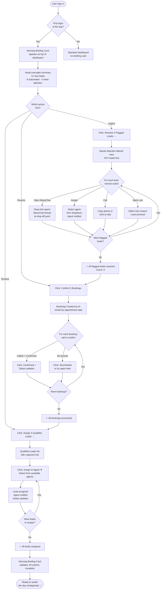
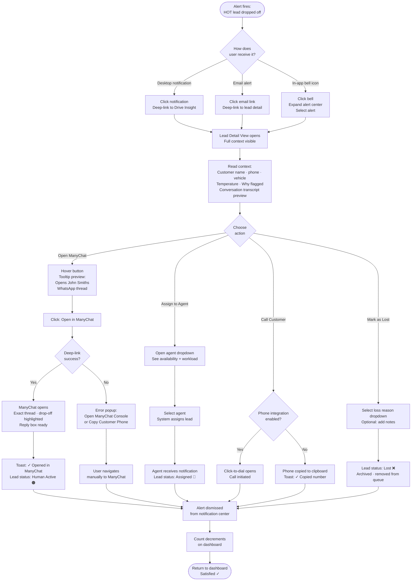
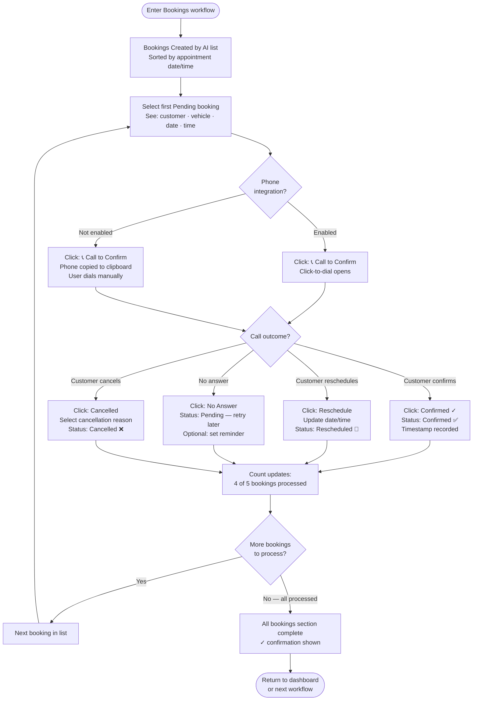
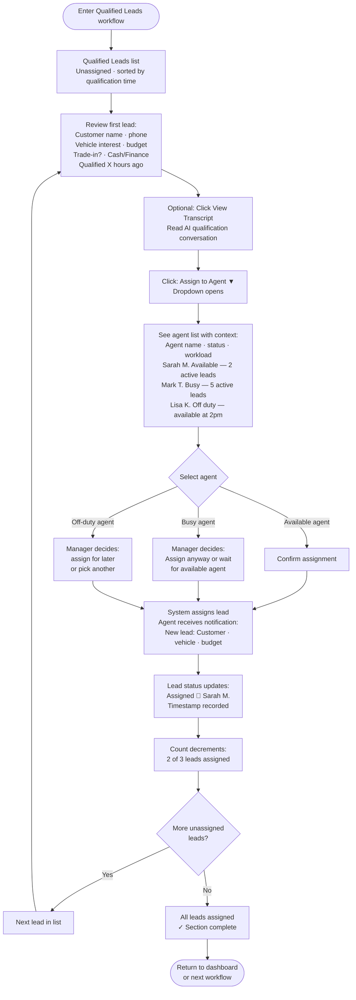
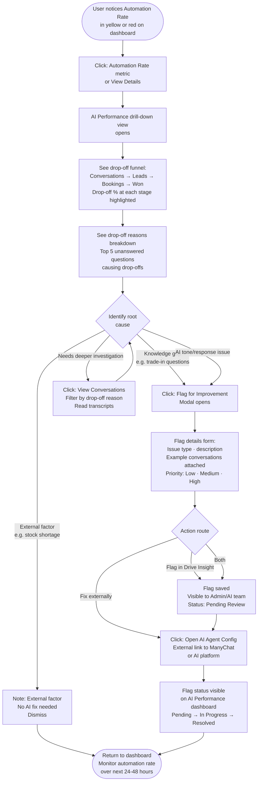

# UX Design Specification — Drive Insight

**Author:** Trinesh
**Date:** 2026-02-12

---

<!-- UX design content will be appended sequentially through collaborative workflow steps -->

## Executive Summary

### Project Vision

Drive Insight is a lightweight, AI-powered overlay dashboard for progressive car dealerships that transforms multi-channel lead chaos into clear ROI insights. It's designed for tech-forward dealerships who are drowning in fragmented tools and want a single, focused command center that shows them exactly how their AI automation is performing and where leads need human attention. The product deliberately avoids feature bloat, instead offering role-optimized views that surface the right information at the right time.

### Target Users

**Primary Audience:**
- Sales Managers and Dealer Principals at tech-progressive dealerships (not traditional family-run operations resistant to digital tools)
- Desktop-first workers who check in morning and evening for strategic reviews
- Sales reps use mobile phones, but customer communication happens via ManyChat mobile app (not Drive Insight)
- Platform Administrators who monitor system health daily and troubleshoot as-needed

**Tech Profile:**
- Comfortable with modern web dashboards and data visualization
- Value simplicity over feature count
- Appreciate automation but want visibility into how it works

**Device Usage:**
- **Primary:** Desktop for dashboards, reporting, and deep-dive analysis
- **Secondary:** Mobile for quick checks (responsive, not native app)
- **Communication:** ManyChat mobile app (separate from Drive Insight)

**Daily Rhythms:**
- **Morning:** Review overnight leads, check automation performance, identify priority actions
- **End of Day:** Pipeline reviews, ROI analysis, team performance assessment
- **Occasional:** Mid-day check-ins when alerts fire

### Key Design Challenges

1. **Cognitive Load Reduction**
   - **Problem:** Users are burned out by complex, feature-heavy systems
   - **Approach:** Role-based dashboards with progressive disclosure and clear visual hierarchy

2. **AI Transparency & Trust**
   - **Problem:** Managers need to understand and trust AI decisions to tune performance
   - **Approach:** Clear conversation transcript tagging, sentiment visualizations, drop-off explanations, and performance comparisons

3. **Real-Time Awareness Without Constant Monitoring**
   - **Problem:** Users check morning and evening but need immediate notification of critical issues
   - **Approach:** Smart configurable alerts, proactive status indicators, and daily digest emails

4. **Single Sign-On & Context Continuity**
   - **Problem:** Login fatigue from multiple systems kills productivity
   - **Approach:** Supabase auth with session persistence and deep linking from email alerts

5. **Mobile-Friendly for Quick Checks**
   - **Problem:** Occasional on-the-floor mobile access without native app complexity
   - **Approach:** Responsive dashboard with touch-friendly controls and key metrics above the fold

### Design Opportunities

1. **"Morning Briefing" Dashboard**
   - Auto-detect first login of the day and surface overnight summary
   - "While you were away: 12 new leads, 8 automated, 4 need attention"
   - One-click jump to priority actions

2. **AI Performance Scorecard**
   - Visual funnel: Conversation → Lead → Booking → Win
   - Hover over drop-off points to see why (sentiment keywords, patterns)
   - AI-suggested fixes based on conversation analysis

3. **Zero-Noise Alerting**
   - User-configurable alert rules (e.g., "Notify me if automation rate drops below 60%")
   - Tiered urgency with color coding (critical/warning/info)
   - In-app notification center (bell icon) + email for critical issues

4. **Cross-Tenant Insights for Admins**
   - Tenant performance leaderboard (gamified healthy competition)
   - Outlier detection: "Tenant X has 2× booking conversion - what are they doing?"
   - Bulk tenant actions (pause all in a region with one click)

## Core User Experience

### Defining Experience

Drive Insight's core experience revolves around the **"lead needs attention" notification → action flow**. Users (primarily Sales Managers and Dealer Principals) perform two key rituals:

1. **Morning Review Ritual (8am):** Log in, see overnight summary, one-click jump to leads needing human attention
2. **Alert-Driven Actions (Throughout Day):** Receive notifications, jump directly to conversation context, take immediate action

The product's value is delivered through **effortless triage** - automatically separating what AI handled successfully from what needs human intervention, with zero friction between awareness and action.

**Core User Actions (Most Frequent):**
- Checking dashboard for overnight leads
- Reviewing conversation transcripts to understand AI interactions
- Managing lead assignments to distribute workload

**Critical Actions (Must Get Right):**
- Identifying which leads need human attention (AI flagging + filtering)
- Tracking leads through full funnel: conversation → booking → sale
- Understanding why conversations dropped off (sentiment, keywords, patterns)
- Managing bookings (confirmations, rescheduling, no-show tracking)

### Platform Strategy

**Primary Platform:**
- Web application (browser-based, no native mobile app)
- Responsive design supporting desktop (primary) and mobile (quick checks)
- Accessed via modern browsers: Chrome, Safari, Edge, Firefox

**Interaction Patterns:**
- **Desktop:** Mouse + keyboard for deep work (transcript review, data analysis, pipeline management)
- **Mobile:** Touch-friendly for quick checks (tap, swipe, scroll through dashboards)
- **No keyboard shortcuts required** for MVP (standard browser navigation)

**Connectivity:**
- 100% online/real-time (no offline functionality)
- Live data updates via Server-Sent Events (SSE)
- Requires stable internet connection for optimal experience

**Notification Strategy:**
- **Primary:** Desktop push notifications (browser-based)
- **Secondary:** Email notifications for critical alerts
- Notifications include deep links directly to relevant conversations/leads

### Effortless Interactions

**1. Automatic Role-Based Dashboards**
- Same dashboard shell for all users (consistency)
- Widgets and data adapt to user role automatically:
  - **Owner:** ROI metrics, automation rate, revenue attribution, cross-dealership insights
  - **Manager:** Pipeline visibility, team performance, SLA compliance, assignment distribution
  - **Agent:** Assigned leads, urgent conversations, follow-up actions, today's bookings
- No manual configuration required - system knows user role from login

**2. Global Search (Always Visible)**
- Persistent search bar in top navigation (always accessible)
- Search across:
  - Customer name, phone number, email
  - Vehicle interest (make, model, year)
  - Date ranges (last 7 days, last 30 days, custom)
  - Lead status (new, qualified, booking created, won, lost)
  - Conversation status (active, completed, abandoned, human_active)
- Search results show:
  - Conversation snippet with matching keywords highlighted
  - Lead status badge and temperature indicator
  - Last activity timestamp
  - Quick action buttons inline

**3. Deep-Linked Alerts with Inline Actions**
- Notifications jump directly to relevant context:
  - "Lead: John Smith - HOT - Dropped off after pricing question" → Opens conversation transcript with drop-off point highlighted
- Alert cards include quick actions without navigation:
  - [Assign to Agent] [Call Customer] [Send Manual WhatsApp] [Mark as Lost]
- Dismissible alerts with "Remind me later" option
- Alert center (bell icon) shows history of all notifications

**4. AI Health at a Glance**
- Single automation rate metric in dashboard header:
  - **"Automation Rate: 68%"** with color coding
  - **Green >70%:** AI performing well
  - **Yellow 50-70%:** Monitor for issues
  - **Red <50%:** Immediate attention required
- Click metric → Drill-down to drop-off analysis and conversation patterns

### Critical Success Moments

**Morning Review Success (8am Login):**
1. **Dashboard shows:** "While you were away: 12 new leads, 8 fully automated, 4 need attention"
2. **One-click action:** "View 4 Priority Leads" button → Filtered list of leads requiring human intervention
3. **Manager workflow:**
   - Address high-value leads first (HOT temperature, high intent)
   - Review automated conversations later (verify AI quality)
4. **Success indicator:** Manager feels in control, no leads slip through cracks

**Lead Needs Attention Flow:**
1. **Alert fires:** "Lead: John Smith - HOT - Dropped off after pricing question"
2. **Click notification** → Conversation transcript opens
3. **Context visible:**
   - Full conversation history (customer + AI messages)
   - AI responses highlighted with agent node labels
   - Drop-off reason shown: "Customer asked about trade-in value, AI couldn't provide estimate"
4. **Actions available inline:**
   - [Assign to Agent] - Route to specific salesperson
   - [Call Customer] - Click-to-dial (if phone integration available)
   - [Send Manual WhatsApp] - Deep link to ManyChat inbox
   - [Mark as Lost] - Record reason and close
5. **Result:** Action taken → Lead status updated → Alert dismissed → User returns to dashboard

**AI Performance Tuning Success:**
1. **Dashboard shows:** "Automation rate: 58% (↓ 12% from last week)" in red
2. **Click metric** → Drill-down view showing:
   - Drop-off reasons breakdown (chart + table)
   - Pattern identified: "10 leads dropped when AI couldn't answer: 'Do you accept trade-ins?'"
   - Top 5 unanswered questions causing drop-offs
3. **Manager action:** Flag "trade-in acceptance" knowledge gap for AI agent improvement
4. **Result:** Clear, actionable insight → Manager knows exactly what to fix in prompts/knowledge base

### Experience Principles

**1. Triage, Don't Overwhelm**
- Automatically separate signal from noise
- Show what needs attention first, hide details until requested
- Use progressive disclosure: summary → detail → deep-dive
- Never force users to process irrelevant information

**2. Context at the Point of Action**
- Never make users hunt for information to complete a task
- Alerts include full context: who, what, why, when
- Actions available inline where decisions are made
- Deep links eliminate navigation overhead

**3. One-Click to Value**
- Morning review: One click from summary to priority leads
- Alert response: One click from notification to actionable conversation
- AI insights: One click from metric to root cause analysis
- Minimize clicks between awareness and resolution

**4. Trust Through Transparency**
- AI decisions always visible and explainable
- Conversation transcripts show exactly what AI said (verbatim)
- Drop-off reasons backed by conversation analysis
- Pattern detection surfaces "why" behind metrics

**5. Progressive Disclosure**
- Start simple: High-level metrics and status indicators
- Drill down on demand: Click metric → See breakdown → View individual conversations
- Respect user attention: Show only what's relevant to current role and task
- Advanced features hidden until needed (no feature bloat)

## Desired Emotional Response

### Primary Emotional Goals

**Core Feeling: Efficient and Productive**
Drive Insight should make users feel like they're getting more done in less time. Every interaction should reinforce the sense that the system is working FOR them, not creating more work. Users should leave each session feeling accomplished and effective.

**Differentiating Emotion: Clarity vs. Confusion**
In stark contrast to cluttered, overwhelming CRM/DMS tools, Drive Insight evokes calm clarity. Users should instantly understand what they're looking at and what needs their attention. The emotional experience is one of cutting through noise to see signal.

**Relationship with Product: "I Actually Feel in Control of My Leads for the First Time"**
This is the feeling users should be compelled to share with colleagues. Drive Insight creates a sense of mastery over the lead pipeline—nothing slips through cracks, AI is transparent and trustworthy, and human intervention happens exactly when and where it's needed.

### Emotional Journey Mapping

**First Discovery (Onboarding):**
- **Desired Emotion:** Curious
- **Experience:** Users discover the platform with intrigue, progressively revealing value without overwhelming
- **Design Support:** Welcoming onboarding, sample data showing immediate value, non-intrusive guided discovery

**Core Experience (Daily Use):**
- **Desired Emotion:** Supported
- **Experience:** Users feel the system has their back—AI handles routine, alerts flag exceptions, context is always available
- **Design Support:** Inline help, contextual suggestions, clear next steps, system status always visible

**After Morning Review Ritual:**
- **Desired Emotion:** Ready to tackle the day strategically
- **Experience:** Users feel organized, informed, and confident about priorities
- **Design Support:** Morning briefing card, prioritized insights, suggested actions, clear visual hierarchy

**Task Completion (Addressing Flagged Leads):**
- **Desired Emotion:** Satisfied
- **Experience:** Users feel accomplished after resolving leads, with clear visual closure
- **Design Support:** Subtle success feedback, updated counts immediately visible, clear "done" states

**When Things Go Wrong (Integration Failures, AI Gaps):**
- **Desired Emotion:** Supported with clear next steps
- **Experience:** Users feel informed and empowered to resolve issues, not panicked or helpless
- **Design Support:** Error messages with actionable steps, system health indicators, troubleshooting guidance

**Returning Users (Daily Habit):**
- **Desired Emotion:** Continued trust
- **Experience:** Users return with confidence that the system is reliable and consistent
- **Design Support:** Consistent performance, transparent AI decisions, data integrity signals, predictable behavior

### Micro-Emotions

**1. Confidence vs. Confusion**
- **Target:** Confidence ("I know exactly what I'm looking at and what to do next")
- **Avoid:** Confusion from cluttered interfaces or unclear metrics

**2. Trust vs. Skepticism**
- **Target:** Continued trust (system is reliable, AI decisions make sense)
- **Avoid:** Skepticism from unexplained AI actions or data inconsistencies

**3. Accomplishment vs. Frustration**
- **Target:** Satisfaction after completing tasks
- **Avoid:** Frustration from multi-step workflows or hidden actions

**4. Support vs. Isolation**
- **Target:** Feeling supported (the system has my back, especially during errors)
- **Avoid:** Isolation when errors occur without clear guidance

**5. Familiarity vs. Learning Curve**
- **Target:** Intuitive familiarity (feels like tools they already know)
- **Avoid:** Steep learning curve requiring extensive training

**6. Calm Focus vs. Anxiety**
- **Target:** Strategic readiness (calm, organized, ready to act)
- **Avoid:** Anxiety from information overload or urgent-but-unclear alerts

### Design Implications

**Creating "Efficient and Productive" Feeling:**
- Fast load times (no spinners, instant transitions)
- Bulk actions where possible (assign multiple leads at once)
- Keyboard-friendly navigation (Tab works smoothly)
- Minimal clicks (one-click from alert to action)

**Creating "In Control of My Leads" Feeling:**
- Always show total counts (12 new leads, 4 need attention)
- Visual indicators of lead status at a glance (color-coded badges)
- Filter and sort controls always visible
- Undo/redo actions (safety net for mistakes)

**Creating "Ready to Tackle the Day Strategically" Feeling:**
- Morning briefing card with prioritized insights
- Clear visual hierarchy (most important info first)
- Suggested actions ("Start here: 4 HOT leads")
- Progress indicators ("You've addressed 3 of 4 priority leads")

**Creating "Clarity vs. Confusion" Feeling:**
- Simple, clean layouts (generous white space)
- Clear labels and terminology (avoid jargon)
- Consistent visual language (same icons, same patterns)
- Tooltips for any unclear elements

**Creating "Curious" Feeling (First Discovery):**
- Welcoming onboarding with progressive reveals
- Sample data showing value immediately
- "Discover" moments (hidden insights surface naturally)
- Non-intrusive help ("Learn more" links, not forced tutorials)

**Creating "Supported" Feeling:**
- Inline help text where needed
- Error messages with clear next steps ("Integration failed. [Retry] [View Logs] [Contact Support]")
- Contextual suggestions ("This lead dropped off. Try assigning to: [Agent Name]")
- System status always visible (green/yellow/red health indicators)

**Creating "Satisfied" Feeling (Task Completion):**
- Subtle success feedback (green checkmark, brief toast notification)
- Updated counts immediately visible
- Clear "done" states (visual closure on completed tasks)
- Micro-celebrations for major milestones (e.g., "All priority leads handled! 🎯")

**Creating "Continued Trust" Feeling:**
- Consistent performance (no surprises, predictable behavior)
- Transparent AI explanations (always show why AI flagged something)
- Data integrity signals (last updated timestamps, sync status)
- Historical accuracy (trends match reality, no unexplained changes)

**Creating "Intuitive Familiarity" Feeling:**
- Follow established UI patterns (tables for lists, cards for summaries)
- Use common conventions (familiar controls and layouts)
- Standard interactions (dropdowns, checkboxes, buttons feel expected)
- Layout similar to CRM tools but simpler

### Emotional Design Principles

**1. Familiarity Breeds Confidence**
Drive Insight should feel immediately recognizable to dealership sales managers. Use patterns, terminology, and layouts that echo tools they already know, reducing cognitive load and eliminating learning curve anxiety.

**2. Transparency Builds Trust**
Every AI decision, metric calculation, and system action should be explainable and visible. Users trust what they understand. Never hide the "why" behind automation.

**3. Clarity Creates Calm**
In a chaotic dealership environment with constant interruptions, Drive Insight is the calm eye of the storm. Clean layouts, clear priorities, and noise reduction create mental space for strategic thinking.

**4. Support Empowers Action**
Users should never feel stuck or alone. Contextual help, clear error messages with next steps, and inline suggestions transform potential frustration into productive problem-solving.

**5. Micro-Wins Fuel Motivation**
Small moments of positive feedback—completed tasks, achieved goals, discovered insights—accumulate into sustained engagement and product love. Celebrate progress without breaking professional tone.

### Emotions to Actively Avoid

- **Overwhelm** - From too much data, too many alerts, or cluttered screens
- **Anxiety** - From unclear urgency, ambiguous metrics, or fear of missing something
- **Frustration** - From slow performance, broken features, or unclear error messages
- **Distrust** - From unexplained AI decisions, inconsistent data, or hidden actions
- **Isolation** - From unhelpful error messages or lack of support when stuck

## UX Pattern Analysis & Inspiration

### Inspiring Products Analysis

**Podium (AI Suite for Dealerships)**
- **Strengths:** Unified messaging hub (WhatsApp + Email + SMS), AI-powered automation with transparency (Jerry AI), mobile-first design
- **Key UX Lessons:** Treat WhatsApp as first-class citizen, show AI and human messages in unified timeline, clear AI attribution in conversations
- **Applicable Patterns:** Multi-channel conversation view, AI message tagging, mobile-responsive layouts

**DealerSocket (Full DMS with Analytics Focus)**
- **Strengths:** Information-dense dashboards that remain usable, analytics on sales volume, agent assignments, closed deals, lost deals with reasons
- **Key UX Lessons:** Information density acceptable if organized well, reason-based analysis is actionable, agent performance tracking critical
- **Applicable Patterns:** Reason-based drop-off analysis, agent leaderboards, time-based filtering, drill-down from summary to detail

**Monday.com CRM (Exceptional UX/UI)**
- **Strengths:** Visual clarity with color-coded statuses, kanban/pipeline views, clean modern design, micro-interactions, collaborative features (@mentions, activity feeds)
- **Key UX Lessons:** Use color coding for temperature/status/urgency, visual progress indicators, clean layouts with white space, activity feeds for "what happened"
- **Applicable Patterns:** Color-coded status badges, card-based layouts, sparklines, persistent left sidebar navigation, inline editing, bulk actions

**South African Local CRMs (CMS Systems)**
- **Strengths:** Localized for SA dealership workflows, lead and operations management focused, familiar patterns without over-innovation
- **Key UX Lessons:** Don't over-innovate—use familiar CRM patterns, SA market values function over fancy, local context matters
- **Applicable Patterns:** Standard CRM table views, familiar terminology, local units and processes

### Transferable UX Patterns

**Navigation Patterns:**
- **Persistent left sidebar** (from Monday.com) with main modules: Overview, Conversations, Leads, Bookings, Analytics, System Health
- **Icon + Label navigation** for clarity with active state highlighting
- **Collapsible sidebar** on mobile to save screen space
- **Breadcrumb navigation** for deep-dive views

**Dashboard Patterns:**
- **Card-based metric layout** (from Monday.com + DealerSocket) with clean separation
- **Sparklines in cards** showing 7-day trends at a glance
- **Color-coded KPIs** (green >70%, yellow 50-70%, red <50%)
- **Morning briefing card** at top (most prominent position)
- **"At a glance" header** with automation rate always visible

**Communication Patterns:**
- **Unified timeline** (from Podium) showing all customer touchpoints chronologically
- **Clear sender attribution**: "Customer" / "AI: Car Fit Agent" / "Human: John (Agent)"
- **WhatsApp-first integration** with click-to-open links to ManyChat
- **Threaded conversations** grouping all messages for one customer

**Analytics Patterns:**
- **Reason-based analysis** (from DealerSocket) for drop-offs and lost deals
- **Top 5 patterns** surfacing actionable insights (e.g., "Top 5 unanswered questions causing drop-offs")
- **Agent performance metrics** with friendly leaderboards
- **Time-based filtering** (7/30/90 days, custom range)
- **Click-through drill-down** from metric to underlying conversations

**Visual Patterns:**
- **Status badges** (from Monday.com) with color + emoji: 🔥 HOT (red), 🌡️ WARM (orange), 🧊 COOL (blue), ❄️ COLD (gray)
- **Progress bars** for completion tracking ("3 of 4 priority leads addressed")
- **Avatar + initials** for assigned agents (visual scanning)
- **Relative timestamps** ("2 hours ago" vs absolute dates)
- **Generous white space** for cognitive breathing room

**Interaction Patterns:**
- **Inline editing** (from Monday.com) - click field to edit without modal
- **Bulk actions** with checkboxes (select multiple leads, assign to agent)
- **Quick actions on hover** (buttons appear when hovering table rows)
- **Contextual menus** ("..." for advanced options)
- **Keyboard navigation** (Tab through forms smoothly)

### Anti-Patterns to Avoid

**1. Login Fatigue**
- **Pattern:** Multiple logins, frequent re-authentication, separate credentials per module
- **Impact:** Users abandon systems requiring constant re-login
- **Solution:** 30-day "Remember me," single sign-on, persistent sessions

**2. Information Overload**
- **Pattern:** Every metric shown at once, no hierarchy, visual noise, cluttered dashboards
- **Impact:** Users can't find critical information, experience cognitive overload
- **Solution:** Role-based widgets, progressive disclosure, clean layouts with white space

**3. Feature Bloat**
- **Pattern:** 50 buttons on one screen, complex navigation, hidden features users can't find
- **Impact:** Users feel overwhelmed, ignore most features, productivity drops
- **Solution:** Primary actions prominent, secondary actions in "...", simple navigation

**4. Unclear Metrics**
- **Pattern:** Numbers without context ("Automation Rate: 68%") - no trend, comparison, or explanation
- **Impact:** Users don't trust metrics or understand significance
- **Solution:** Always show: Value + Delta + Trend + Click for details

**5. Dead-End Errors**
- **Pattern:** "Integration failed. Error 500." with no next steps or context
- **Impact:** Users feel helpless, support tickets surge, trust erodes
- **Solution:** Error messages with actions: [Retry] [View Logs] [Contact Support] + last success timestamp

**6. Notification Overload**
- **Pattern:** 50 notifications for minor events, no urgency differentiation
- **Impact:** Alert fatigue, users ignore all notifications, miss critical alerts
- **Solution:** Configurable thresholds, tiered urgency (critical/warning/info), digest emails

**7. Hidden AI Decisions (Black Box)**
- **Pattern:** Lead marked "COLD" or conversation flagged with no explanation why
- **Impact:** Users distrust AI, override decisions, system loses value
- **Solution:** Always show reasoning: "COLD: Last contact 14 days ago, no response to 3 follow-ups"

### Design Inspiration Strategy

**What to Adopt Directly:**
- **Monday.com's visual language** - Color-coded status badges, clean card layouts, generous white space, modern professional aesthetic
- **Podium's unified timeline** - All customer interactions chronologically with clear AI/human attribution
- **DealerSocket's reason-based analytics** - Show "why" behind numbers (e.g., "10 lost: 5 pricing, 3 no stock, 2 finance")

**What to Adapt for Drive Insight:**
- **Monday.com's Kanban boards** → Adapt to **horizontal funnel visualization** (Conversation → Lead → Booking → Win with drop-off analysis)
- **Podium's AI chat interface** → Adapt to **read-only transcript view with analysis** (ManyChat handles replies, Drive Insight provides insights)
- **DealerSocket's agent performance** → Adapt to **AI automation performance tracking** (which AI agents/prompts need improvement)
- **CRM pipeline views** → Adapt to **lead temperature distribution** (visual heatmap of HOT/WARM/COOL/COLD leads)

**What to Avoid:**
- **DMS feature overload** - Don't attempt to be a full DMS with inventory, accounting, parts management (stay focused on AI ROI overlay)
- **CRM complex workflows** - Don't require 10-step processes to update lead status (keep actions one-click where possible)
- **Generic SaaS analytics** - Avoid dashboards that look like every other SaaS product (use dealership-specific language and metrics)
- **Over-automation** - Don't hide human control (dealers want AI assistance, not AI replacement)

## Design System Foundation

### Design System Choice

**Primary Design System:** **Shadcn/UI + Tailwind CSS**

This design system choice has already been confirmed in the architecture document and aligns perfectly with Drive Insight's UX goals and technical stack.

### Rationale for Shadcn/UI

**Why Shadcn/UI is the Perfect Fit:**

1. **Copy-Paste Component Library (You Own the Code)**
   - Unlike traditional UI libraries, Shadcn/UI provides components you copy into your codebase
   - Full ownership and customization control—no black-box dependencies
   - Components live in your project, not node_modules
   - Perfect for building dealership-specific custom components on top

2. **Built on Proven Technologies**
   - **Tailwind CSS:** Utility-first CSS framework for rapid styling
   - **Radix UI:** Unstyled, accessible primitives for complex components (Dialog, DropdownMenu, Accordion, etc.)
   - **TypeScript:** Strongly typed throughout for maintainability
   - **class-variance-authority (CVA):** Type-safe component variants (e.g., Badge variants: HOT, WARM, COOL, COLD)

3. **Matches "Clean, Familiar UX" Goal**
   - Professional, modern aesthetic similar to Monday.com
   - Clean layouts with generous white space
   - Not over-stylized—feels like a business dashboard, not a consumer app
   - Familiar patterns that dealership users will recognize from other SaaS tools

4. **Supports Information-Dense Dashboards**
   - Excellent **Table** component for lead lists with sorting, filtering, and inline actions
   - **Card** component with clean separation for metric cards
   - **Badge** and **Avatar** components for visual scanning
   - **Scroll Area** component for long conversation timelines without clutter
   - **Chart** integration via Recharts for sparklines and analytics

5. **Fast Development Speed**
   - 50+ pre-built components ready to copy
   - Consistent design tokens (colors, spacing, typography)
   - Built-in dark mode support (future enhancement)
   - Comprehensive documentation with examples

6. **Perfect for Next.js + TypeScript Stack**
   - Designed for Next.js App Router (Server Components + Client Components)
   - TypeScript-first with full type safety
   - Works seamlessly with Jotai state management
   - Server-Side Rendering (SSR) compatible

### Shadcn/UI Component Mapping to Drive Insight Features

| Drive Insight Feature | Shadcn Component | Usage |
|----------------------|------------------|-------|
| Lead temperature indicators | **Badge** | Custom variants: HOT (red), WARM (orange), COOL (blue), COLD (gray) with emoji |
| Metric cards (Automation Rate, etc.) | **Card** | CardHeader + CardContent + custom Recharts sparkline |
| Lead lists / Conversation lists | **Table** | DataTable with sorting, filtering, pagination |
| Agent assignments | **Avatar** | Show assigned agent with initials and tooltip |
| Alert notifications | **Alert** | Critical/Warning/Info variants with inline actions |
| Search bar | **Command** | Global search with fuzzy matching and keyboard shortcuts |
| Conversation transcript | **Scroll Area** | Long message timelines with auto-scroll to latest |
| Dropdowns (filters, actions) | **DropdownMenu** | Contextual menus and bulk actions |
| Modals (lead detail view) | **Dialog** | Full-screen or modal overlays for deep dives |
| Status indicators | **Badge** + **Progress** | Visual status (active, completed, abandoned) with progress bars |
| Charts and sparklines | **Recharts** (integrates with Shadcn) | Line charts, bar charts, sparklines for trends |

### Implementation Plan

**Phase 1: Initialize Shadcn/UI**
```bash
# Initialize Shadcn/UI in Next.js project
npx shadcn@latest init

# Configure components.json with Drive Insight design tokens
# Choose: New York style (clean, professional)
# Choose: Zinc color palette (neutral, professional)
```

**Phase 2: Install Core Components**
```bash
# Install foundational components for MVP
npx shadcn@latest add button
npx shadcn@latest add card
npx shadcn@latest add badge
npx shadcn@latest add table
npx shadcn@latest add avatar
npx shadcn@latest add alert
npx shadcn@latest add scroll-area
npx shadcn@latest add dropdown-menu
npx shadcn@latest add dialog
npx shadcn@latest add command
```

**Phase 3: Customize Design Tokens**

Extend Tailwind config with Drive Insight brand colors:

```typescript
// tailwind.config.ts (customization layer)
export default {
  theme: {
    extend: {
      colors: {
        // Brand colors
        brand: {
          primary: '#0066CC',    // Drive Insight blue
          secondary: '#00A86B',  // Success green
        },
        // Temperature colors
        temperature: {
          hot: '#DC2626',        // Red (>80% intent)
          warm: '#F59E0B',       // Orange (60-80% intent)
          cool: '#3B82F6',       // Blue (40-60% intent)
          cold: '#9CA3AF',       // Gray (<40% intent)
        },
        // Status colors
        status: {
          active: '#10B981',     // Green (conversation ongoing)
          completed: '#6366F1',  // Purple (successful close)
          abandoned: '#EF4444',  // Red (dropped off)
          human_active: '#F59E0B', // Orange (human intervention)
        }
      }
    }
  }
}
```

**Phase 4: Build Custom Components**

Extend Shadcn components for Drive Insight-specific needs:

1. **LeadTemperatureBadge** (extends Shadcn Badge)
   ```tsx
   // Custom component with temperature-specific styling
   <Badge variant={temperature}>
     {temperature === 'HOT' && '🔥'} HOT
     {temperature === 'WARM' && '🌡️'} WARM
     {temperature === 'COOL' && '🧊'} COOL
     {temperature === 'COLD' && '❄️'} COLD
   </Badge>
   ```

2. **ConversationTimeline** (extends Shadcn ScrollArea)
   ```tsx
   // Unified timeline with AI/customer/human attribution
   <ScrollArea className="h-[600px]">
     {messages.map(msg => (
       <MessageBubble
         sender={msg.sender} // 'customer' | 'ai' | 'human'
         content={msg.content}
         timestamp={msg.timestamp}
       />
     ))}
   </ScrollArea>
   ```

3. **MetricCard** (extends Shadcn Card + Recharts)
   ```tsx
   // Card with sparkline and trend indicator
   <Card>
     <CardHeader>
       <CardTitle>Automation Rate</CardTitle>
       <CardDescription>Last 7 days</CardDescription>
     </CardHeader>
     <CardContent>
       <div className="text-3xl font-bold text-green-600">68%</div>
       <p className="text-sm text-muted-foreground">↑ 5% from last week</p>
       <Sparkline data={weeklyData} />
     </CardContent>
   </Card>
   ```

4. **MorningBriefingCard** (custom composite component)
   ```tsx
   // Special card for first-login-of-day summary
   <Card className="border-l-4 border-l-blue-500">
     <CardHeader>
       <CardTitle>While you were away...</CardTitle>
     </CardHeader>
     <CardContent>
       <ul className="space-y-2">
         <li>📥 12 new leads</li>
         <li>✅ 8 fully automated</li>
         <li>⚠️ 4 need attention</li>
       </ul>
       <Button className="mt-4" variant="default">
         View 4 Priority Leads →
       </Button>
     </CardContent>
   </Card>
   ```

### Customization Strategy

**When to Use Shadcn Components As-Is:**
- Standard UI patterns (buttons, dropdowns, dialogs, tables)
- Form inputs and validation
- Layout primitives (cards, separators, scroll areas)

**When to Extend Shadcn Components:**
- **Badge:** Extend for temperature and status variants with custom colors
- **Card:** Extend for metric cards with sparklines and trend indicators
- **Table:** Extend for lead/conversation lists with inline actions and bulk selection
- **Alert:** Extend for tiered urgency notifications (critical/warning/info)

**When to Build Custom Components:**
- **ConversationTimeline:** Complex message threading with AI/human/customer attribution
- **MorningBriefingCard:** Special first-login summary with contextual content
- **FunnelVisualization:** Custom horizontal funnel (Conversation → Lead → Booking → Win)
- **AIHealthIndicator:** Custom automation rate visualization with color-coded thresholds

### Design Token Consistency

**Color Palette:**
- **Primary:** Blue (#0066CC) - Brand, primary actions, links
- **Success:** Green (#00A86B) - Completed tasks, positive metrics
- **Warning:** Yellow/Orange (#F59E0B) - Needs attention, moderate urgency
- **Danger:** Red (#DC2626) - Critical alerts, negative metrics
- **Neutral:** Zinc palette (gray shades) - Text, borders, backgrounds

**Typography:**
- **Font Family:** Inter (system font fallback: -apple-system, BlinkMacSystemFont, "Segoe UI")
- **Headings:** Font weights 600-700 for hierarchy
- **Body:** Font weight 400 for readability
- **Data/Metrics:** Font weight 500-600 for emphasis

**Spacing:**
- Follow Tailwind's spacing scale (4px increments)
- Generous padding in cards (p-6 for desktop, p-4 for mobile)
- Consistent gap between elements (gap-4 for related items, gap-6 for sections)

**Interaction States:**
- **Hover:** Subtle background change (e.g., hover:bg-gray-100)
- **Active:** Pressed state with slight scale (active:scale-95)
- **Focus:** Blue ring for keyboard navigation (focus:ring-2 focus:ring-blue-500)
- **Disabled:** Reduced opacity and cursor-not-allowed

### Accessibility Foundations

Shadcn/UI is built on Radix UI primitives, which provide:
- **Keyboard Navigation:** All interactive elements focusable and operable via keyboard
- **Screen Reader Support:** ARIA attributes for semantic meaning
- **Focus Management:** Proper focus trapping in dialogs and menus
- **Color Contrast:** WCAG AA compliance for text and interactive elements

**Drive Insight-Specific Accessibility:**
- All temperature badges have text labels (not just color coding)
- Sparklines include data table fallback for screen readers
- Alert notifications announce urgency level
- Time-based data includes absolute timestamps for context

## Defining Core Experience

### The Defining Interaction

**Drive Insight's defining experience is effortless lead triage with three distinct workflows:**

> **"The system continuously separates AI successes (routine follow-up) from AI failures (urgent intervention needed), explains why attention is needed with conversation analysis, and enables one-click contextual jumps from notification/summary to the exact action surface (ManyChat inbox, phone call, agent assignment, outcome closure)—with zero friction between awareness and action."**

This is not a messaging platform—ManyChat remains the surface for human replies. Drive Insight is the **AI air traffic control dashboard** that ensures no lead slips through cracks while eliminating information overload and cross-system friction.

**The core interaction users will describe to colleagues:**

*"I log in, see exactly which leads AI handled successfully (8 bookings and qualified leads) and which need urgent help (4 dropped conversations). I tackle the urgent ones first—click, I'm in the ManyChat conversation right where the AI got stuck. Then I confirm the bookings and assign the qualified leads. No searching, no guessing, no wasted time."*

**If we get ONE thing perfectly right:**

**Triage → Explain → Contextual Jump** must feel instantaneous, trustworthy, and magical—eliminating the cognitive load of "where do I go now?" and "what was I supposed to do here?"

---

### User Mental Model

**Current Reality (Pain Points):**

Dealership managers currently experience:
1. **Too many logins** across DMS, CRM, ManyChat, phone system, spreadsheets
2. **Information overload** with no clear signal-to-noise separation
3. **Feature bloat** in complex systems where they use <20% of features
4. **Manual lead hunting** across multiple inboxes to find what needs attention
5. **Context switching fatigue** remembering customer details when jumping between tools
6. **AI black box anxiety** not knowing if automation is working or missing leads

**Mental Model: "AI Air Traffic Control for Leads"**

Users think of Drive Insight as their **lead radar screen with three runways**:

**Runway 1: AI Successes (Routine Follow-up - Green Zone)**
- Leads where AI successfully completed its task (qualified lead or created booking)
- Human action needed: Routine follow-up (confirmation calls, agent assignment)
- Urgency: Not urgent - handle systematically during business hours
- Emotion: Positive reinforcement ("AI is working!") + productive routine tasks

**Runway 2: Needs Attention (Urgent Rescue - Red/Orange Zone)**
- Leads where AI couldn't complete the task (unanswered question, customer confused, dropped off)
- Human action needed: Immediate intervention to rescue the conversation
- Urgency: High - customer is waiting or lost momentum
- Emotion: Alert ("I need to jump on this") + problem-solving

**Runway 3: Future/Scheduled Follow-ups (Calendar-Driven - Blue Zone)**
- Leads with scheduled callbacks, appointment reminders, etc.
- Human action needed: Time-based follow-up actions
- Urgency: Calendar-driven

**Air Traffic Control Dashboard Elements:**
- **Radar Screen:** Dashboard showing all incoming leads with status (conversations in flight)
- **Priority Alerts:** Flagged leads that need immediate attention (emergency situations)
- **Clearance to Land:** Assign leads to available agents (route to correct runway)
- **Communication Channel:** Jump to ManyChat for direct customer interaction (connect to pilot)
- **No Crashes:** AI ensures zero leads slip through cracks (no missed flights)
- **Flight Logs:** Full conversation transcripts for every interaction (audit trail)

**User Expectations:**

1. **Morning briefing metaphor:** Like a shift handover—"Here's what happened overnight: AI wins + urgent issues + your action list"
2. **Alert urgency tiers:** Not all alerts are equal—AI failures (urgent) vs. AI successes (routine follow-up)
3. **One-click resolution:** From awareness to action should never require navigation or searching
4. **AI transparency:** If AI flagged something, show me exactly why with conversation evidence

**Existing Mental Models to Leverage:**

- **CRM pipeline views** (familiar table layouts, status badges, filters)
- **Support ticket dashboards** (notification → ticket detail → action)
- **Email inbox triage** (unread count, priority flags, archive/action decisions)
- **Calendar reminders** (contextual alerts with snooze/dismiss/act options)

---

### Success Criteria for Core Experience

**Users say "this just works" when:**

**1. Trust through accuracy:**
- AI triage correctly identifies 95%+ of leads needing urgent attention
- No false positives (flagging leads that don't actually need urgent help)
- No missed leads (HOT leads never slip through unnoticed)
- Clear separation: AI successes (green, positive) vs. AI failures (red/orange, urgent)
- **Success indicator:** "I trust the dashboard to tell me what's urgent vs. routine"

**2. Instantaneous awareness:**
- Morning summary loads in <2 seconds
- Dashboard shows real-time counts (8 AI successes, 4 need attention)
- No stale data—user confidence that numbers reflect current state
- **Success indicator:** "I know the situation at a glance"

**3. Magical deep-linking (ManyChat jump):**
- Click "Open in ManyChat" → Opens **exact conversation thread, scrolled to drop-off point**
- Zero navigation required—user lands precisely where AI stopped
- Contextual tooltip before click: "Opens: John Smith's WhatsApp thread (last message: 2 hours ago)"
- **Success indicator:** "It knew exactly where I needed to be. Zero thinking required."

**What makes it magical vs. "just another tab":**
- **Bad:** Opens ManyChat homepage → User searches for customer → Finds conversation (4+ steps)
- **Magical:** Opens ManyChat to John Smith's thread, highlighted, ready for reply (0 extra steps)

**Deep-link trust signals:**
- After successful click: "✓ Opened in ManyChat" (green confirmation badge, 3 seconds)
- If deep-link fails: Popup with fallback: "[Open ManyChat Console] [Copy Customer Phone]" + red alert notification

**4. Contextual action readiness:**
- All actions available inline where decisions are made
- Three distinct action patterns:
  - **Needs Attention:** [Open ManyChat] [Call] [Assign] [Mark Lost]
  - **Bookings:** [Call to Confirm] [View Details] [Reschedule]
  - **Qualified Leads:** [Assign to Agent ▼]
- No modal overlays or multi-step wizards for simple tasks
- Bulk actions for repetitive tasks (assign 5 leads to Agent A at once)
- **Success indicator:** "I resolved 4 urgent leads + confirmed 5 bookings in under 5 minutes"

**5. Automatic context preservation:**
- User never has to remember customer details or conversation history
- Transcript visible with AI drop-off reason highlighted
- Lead temperature, vehicle interest, timeline all visible at point of action
- **Success indicator:** "I never have to ask 'wait, what was this customer asking about?'"

**6. Clear completion feedback:**
- Action taken → Status updates immediately → Count decrements visibly
- "3 of 4 priority leads addressed" progress indicator
- Subtle success confirmation (not annoying, just reassuring)
- **Success indicator:** "I feel accomplished and know what's left"

**Speed Expectations:**

- Dashboard load: <2 seconds
- Conversation transcript load: <1 second
- ManyChat deep-link opens: <3 seconds (external system dependency)
- Action response (assign/close): <500ms (feels instant)

**Automatic vs. Manual:**

- **Automatic:** Lead triage (AI success vs. needs attention), temperature calculation, drop-off reason detection, morning briefing generation, outcome categorization (booking vs. qualified lead)
- **Manual (user control):** Agent assignment, booking confirmation calls, outcome closure, alert configuration, filter/sort preferences

---

### Novel vs. Established UX Patterns

**Primary Pattern: Established (Dashboard-to-Action Jump)**

Drive Insight uses **proven CRM/support ticket patterns** that dealership managers already understand:

- **Dashboard with metric cards** (familiar from Monday.com, DealerSocket, Salesforce)
- **Lead lists with sortable tables** (universal CRM pattern)
- **Notification → Detail → Action flow** (Zendesk, Intercom, Slack)
- **Deep-linking to external tools** (GitHub, Jira, email clients)

**Design Decision:** **Do NOT innovate on core navigation patterns.** Use familiar layouts to eliminate learning curve.

---

**Novel Twist #1: AI Transparency Layer**

What makes Drive Insight different is the **AI reasoning visibility**:

**Established Pattern (CRM lead scoring):**
- Lead shows "COLD" status with no explanation
- User doesn't know why or how to fix it
- **Result:** Distrust, manual overrides, ignored scores

**Drive Insight's Novel Approach (AI transparency):**
- Lead shows "HOT 🔥" with explanation: "Customer asked about specific vehicle (2024 Ford Ranger), requested test drive availability, responded within 5 minutes"
- Click "Why flagged?" → Shows conversation snippet with AI analysis: "AI couldn't answer: 'Do you accept trade-ins?' - Customer waiting for response"
- **Result:** Trust through understanding, actionable insights for prompt improvement

**Teaching This Pattern:**

Users instantly recognize the **dashboard → detail → action flow**. The novel AI transparency requires minimal education:

1. **Onboarding tooltip (first login):** "🔍 Click 'Why flagged?' on any lead to see AI's reasoning"
2. **Inline help text:** Subtle "?" icon next to temperature badges with tooltip: "Based on response time, intent keywords, and engagement"
3. **Progressive discovery:** Users naturally click badges out of curiosity, discover explanations, build trust

**Familiar Metaphor:** Think of AI reasoning like **email spam filters showing why a message was flagged** ("Keywords: 'urgent', 'wire transfer', suspicious link"). Users understand this pattern.

---

**Novel Twist #2: Three-Workflow Triage System**

**Established Pattern (Support ticket queues):**
- Single "Open Tickets" queue with priority flags
- All tickets require human action
- No separation of "automation worked" vs. "automation failed"

**Drive Insight's Novel Approach:**
- **Three distinct queues** with different urgency and emotional tone:
  1. **AI Successes (Green):** Positive reinforcement + routine follow-up
  2. **Needs Attention (Red/Orange):** Urgent rescue + problem-solving
  3. **Future Follow-ups (Blue):** Calendar-driven actions

**Why This Works:**
- Users feel **accomplishment** seeing AI successes (not just problems)
- Clear **priority ordering** (urgent first, routine second)
- Different **action patterns** for different workflows (confirmation vs. assignment vs. rescue)

**Teaching This Pattern:**
- Morning Briefing Card explicitly shows three categories
- Visual color coding (green = good, red/orange = urgent)
- Suggested action order: "Your priority actions: 1. Resolve 4 flagged, 2. Confirm 5 bookings, 3. Assign 3 leads"

---

**Innovative Combination: Morning Briefing Card**

**Established Patterns Combined:**
- Email digest summaries (overnight activity recap)
- Calendar daily agenda (prioritized list of what needs attention)
- Mobile notification summaries (grouped alerts with counts)

**Drive Insight's Synthesis:**

```
┌─────────────────────────────────────────────────────────┐
│ 🌅 While you were away...                               │
├─────────────────────────────────────────────────────────┤
│ 📥 12 new leads                                         │
│                                                         │
│ AI Performance:                                         │
│ ✅ 8 handled automatically (AI completed its role):     │
│    • 🗓️ 5 bookings created → need confirmation calls   │
│    • 📋 3 leads qualified → need agent assignment       │
│                                                         │
│ ⚠️ 4 need attention (AI couldn't complete):             │
│    • 🔥 2 HOT (pricing/trade-in questions unanswered)   │
│    • 🌡️ 2 WARM (general inquiries, customer waiting)   │
│                                                         │
│ 📋 Your priority actions:                               │
│ 1. [Resolve 4 Flagged Leads →] (URGENT)                │
│ 2. [Confirm 5 Bookings →]                              │
│ 3. [Assign 3 Qualified Leads →]                        │
└─────────────────────────────────────────────────────────┘
```

**Why it works:** Combines familiar summary pattern with clear priority ordering and one-click actions, matching user's morning ritual mental model.

---

### Experience Mechanics (Detailed Flows)

#### **Morning Review Ritual (8am Login)**

**1. Initiation:**
- User logs in at 8am (first login of the day detected automatically via last_login timestamp)
- System recognizes this as morning review ritual (no explicit trigger needed)

**2. Dashboard Load:**
- Morning Briefing Card renders prominently at top of dashboard
- Shows three categories:
  - **AI Successes:** "✅ 8 handled automatically: 5 bookings, 3 qualified leads"
  - **Needs Attention:** "⚠️ 4 need attention: 2 HOT, 2 WARM"
  - **Priority Actions:** Ordered list with click-through buttons
- Below briefing: Standard dashboard widgets (automation rate, recent activity, three workflow queues)

**3. User Decision - Priority Action Flow:**

**Action 1: Resolve 4 Flagged Leads (URGENT)**
- User clicks **"[Resolve 4 Flagged Leads →]"** button
- Navigates to "Needs Attention" filtered view
- Shows list of 4 leads sorted by temperature (HOT first) and recency

**Lead List View:**
```
⚠️ Needs Attention (4 leads)

┌─────────────────────────────────────────────────────────┐
│ 🔥 HOT - John Smith                [Assign ▼] [✕]       │
│ 📱 +27 82 555 1234                                      │
│ 🚗 2024 Ford Ranger                                     │
│ ⚠️ Asked about trade-ins, AI couldn't answer            │
│ ⏱️ 2 hours ago                                          │
│ [Open ManyChat] [📞 Call] [Mark Lost ▼]                │
├─────────────────────────────────────────────────────────┤
│ 🔥 HOT - Sarah Lee                 [Assign ▼] [✕]       │
│ 📱 +27 83 444 5678                                      │
│ 🚗 2023 Toyota Hilux                                    │
│ ⚠️ Pricing question, AI no response                     │
│ ⏱️ 45 minutes ago                                       │
│ [Open ManyChat] [📞 Call] [Mark Lost ▼]                │
└─────────────────────────────────────────────────────────┘
[Show 2 more WARM leads ▼]
```

**User resolves each lead using contextual actions** (detailed flow in Alert-Driven Action scenario below)

---

**Action 2: Confirm 5 Bookings**
- User clicks **"[Confirm 5 Bookings →]"** button
- Navigates to "Bookings Created by AI" view
- Shows list of 5 bookings sorted by appointment date/time

**Bookings List View:**
```
✅ Bookings Created by AI (5)
Need confirmation calls

┌─────────────────────────────────────────────────────────┐
│ 🗓️ Mike Jones                       [Confirmed ✓]       │
│ 📱 +27 84 123 4567                                      │
│ 🚗 Test drive: 2024 Ford Ranger                         │
│ 📅 Tomorrow, 10:00 AM                                   │
│ [📞 Call to Confirm] [View Transcript] [Reschedule]    │
├─────────────────────────────────────────────────────────┤
│ 🗓️ Lisa Brown                       [Pending]           │
│ 📱 +27 85 987 6543                                      │
│ 🚗 Test drive: 2023 Toyota Hilux                        │
│ 📅 Friday, 2:00 PM                                      │
│ [📞 Call to Confirm] [View Transcript] [Reschedule]    │
└─────────────────────────────────────────────────────────┘
[Show 3 more bookings ▼]
```

**Confirmation Workflow:**
- User clicks **[📞 Call to Confirm]**
- If phone integration enabled: Click-to-dial opens phone system
- If no phone integration: Copies phone number to clipboard
- After call: User clicks **[Confirmed ✓]** button
- Status updates: Booking marked as "Confirmed" with timestamp
- Count decrements: "4 of 5 bookings confirmed"

---

**Action 3: Assign 3 Qualified Leads**
- User clicks **"[Assign 3 Qualified Leads →]"** button
- Navigates to "Leads Qualified by AI" view
- Shows list of 3 qualified leads with captured information

**Qualified Leads List View:**
```
✅ Leads Qualified by AI (3)
Need agent assignment

┌─────────────────────────────────────────────────────────┐
│ 📋 Tom White                        [Unassigned]        │
│ 📱 +27 86 234 5678                                      │
│ 🚗 Interested: 2024 VW Amarok                           │
│ 💰 Budget: R500k | Trade-in: Yes                        │
│ ⏱️ Qualified 3 hours ago                                │
│ [Assign to Agent ▼] [View Transcript]                  │
├─────────────────────────────────────────────────────────┤
│ 📋 Emma Green                       [Unassigned]        │
│ 📱 +27 87 345 6789                                      │
│ 🚗 Interested: 2023 Nissan Navara                       │
│ 💰 Budget: R400k | Cash buyer                           │
│ ⏱️ Qualified 1 hour ago                                 │
│ [Assign to Agent ▼] [View Transcript]                  │
└─────────────────────────────────────────────────────────┘
[Show 1 more lead ▼]
```

**Assignment Workflow:**
- User clicks **[Assign to Agent ▼]** dropdown
- Shows available agents with current workload:
  - Sarah M. (Available - 2 active leads)
  - Mark T. (Busy - 5 active leads)
  - Lisa K. (Off duty - available at 2pm)
- User selects "Sarah M."
- System assigns lead, sends notification to Sarah
- Lead status updates: "👤 Assigned to: Sarah M."
- Count decrements: "2 of 3 qualified leads assigned"

---

**4. Completion Feedback:**
- All three workflows complete
- Morning Briefing Card updates to show progress:
  - "✓ 4 flagged leads resolved"
  - "✓ 5 bookings confirmed"
  - "✓ 3 qualified leads assigned"
- **Emotional payoff:** "Ready to tackle the day strategically - pipeline is under control"

---

#### **Alert-Driven Action Flow (Throughout Day)**

**1. Initiation:**
- Lead drops off after AI interaction at 11:34am
- System detects: Customer asked question AI couldn't answer
- Lead temperature: HOT (high intent keywords, fast response time)
- Alert rule triggers: "Notify immediately for HOT lead drop-offs"

**2. Notification Delivery:**
- **Desktop notification (primary):** "🔥 Lead: John Smith - HOT - Dropped off after pricing question"
- **Email notification (secondary):** Subject: "[Drive Insight] HOT Lead Needs Attention - John Smith"
- **In-app alert center:** Bell icon shows red badge (1 unread alert)

**3. User Clicks Notification:**
- Desktop notification click → Opens Drive Insight, navigates directly to lead detail view
- Email click → Deep-link to Drive Insight lead detail view
- Bell icon click → Expands alert center dropdown, user selects specific alert

**4. Lead Detail View (Full Context):**

```
┌─────────────────────────────────────────────────────────┐
│ 🔥 HOT - John Smith                    [Assign ▼] [✕]   │
├─────────────────────────────────────────────────────────┤
│ 📱 +27 82 555 1234                                      │
│ 🚗 Interested in: 2024 Ford Ranger                      │
│ ⏱️  Last message: 23 minutes ago                        │
│                                                         │
│ ⚠️  Why flagged: Customer asked "What's your trade-in   │
│    policy?", AI couldn't provide estimate               │
├─────────────────────────────────────────────────────────┤
│ 💬 Conversation Transcript (last 5 messages)            │
│                                                         │
│ [Customer] Hi, I'm interested in the 2024 Ford Ranger   │
│ [AI: Car Fit Agent] Great choice! The Ranger is...      │
│ [Customer] What's your trade-in policy?                 │
│ [AI: Car Fit Agent] Let me connect you with...  ⚠️      │
│ [No response from customer for 23 minutes]              │
│                                                         │
│ [View Full Transcript ↓]                                │
├─────────────────────────────────────────────────────────┤
│ Quick Actions:                                          │
│ [Open in ManyChat] [📞 Call] [Assign to Agent ▼]       │
│ [Mark as Lost ▼]                                        │
└─────────────────────────────────────────────────────────┘
```

**5. User Takes Action (One-Click Contextual Jump):**

**Option A: Open in ManyChat**
- User hovers → Tooltip: "Opens: John Smith's WhatsApp thread (last message: 23 min ago)"
- User clicks **"Open in ManyChat"**
- **System behavior:**
  - Opens new tab: `manychat.com/inbox?conversation_id=12345&highlight_message=67890`
  - ManyChat loads directly to John Smith's conversation, scrolled to drop-off point
  - Reply box ready for human response
- **Drive Insight feedback:**
  - Toast (3 sec): "✓ Opened in ManyChat"
  - Lead status: "Human Active 🟠"
  - Alert dismissed from notification center

**Failure handling:**
- If deep-link fails:
  - Popup: "Couldn't open this conversation directly. [Open ManyChat Console] [Copy Phone: +27 82 555 1234]"
  - Red alert: "ManyChat link failed for John Smith. Contact support if issue persists."

**Option B: Assign to Agent**
- User clicks **"Assign to Agent ▼"** dropdown
- Shows list of available agents with status and workload
- User selects agent
- System assigns lead, sends notification to agent
- Lead status updates with avatar
- Toast: "✓ Assigned to [Agent Name]"
- Count updates

**Option C: Call Customer**
- Click **[📞 Call]**
- If phone integration: Click-to-dial opens with number
- If no integration: Copies phone to clipboard, toast: "✓ Copied +27 82 555 1234"
- Lead status: "Call in progress 📞"

**Option D: Mark as Lost**
- Click **[Mark as Lost ▼]** → Dropdown with loss reasons
- Select reason: "No response from customer"
- Optional: Add notes
- Lead status: "Lost ❌", archived, removed from "needs attention" count

**6. Completion:**
- Action taken → Status updated → Alert dismissed
- User returns to dashboard
- Count updates visibly
- **Emotional payoff:** "Satisfied - I handled that efficiently"

## Visual Design Foundation

### Color System

**Primary Brand Direction: "Command Blue"**

Drive Insight's visual identity is built on a confident, professional blue palette that communicates trust, authority, and data clarity. Inspired by Monday.com's clean aesthetic and tailored for information-dense dealership dashboards.

**Core Palette:**

```
--- Brand Colors ---
Primary:          #1D6AE5  (Command Blue — trust, authority, action)
Primary Dark:     #1552B8  (Hover states, active navigation)
Primary Light:    #EFF6FF  (Subtle backgrounds, selected states)

--- Neutrals (Zinc base from Shadcn/UI) ---
Background:       #F8F9FC  (Light mode — cool near-white)
Surface:          #FFFFFF  (Cards, modals, panels)
Border:           #E2E8F0  (Subtle element separation)
Text Primary:     #0F172A  (Near-black — maximum readability)
Text Secondary:   #475569  (Body text, descriptions)
Text Muted:       #64748B  (Labels, timestamps, secondary info)

--- Dark Mode Equivalents ---
Background:       #0F172A  (Deep navy)
Surface:          #1E293B  (Cards, panels)
Border:           #334155  (Subtle dark separation)
Text Primary:     #F1F5F9  (Near-white)
Text Secondary:   #CBD5E1  (Body text)
Text Muted:       #94A3B8  (Labels, timestamps)
```

**Semantic Color Mapping:**

```
--- Functional Colors ---
Success:          #16A34A  (Green — AI successes, bookings confirmed, completed)
Success Light:    #F0FDF4  (Success backgrounds, positive states)
Warning:          #D97706  (Amber — needs attention, moderate urgency, WARM leads)
Warning Light:    #FFFBEB  (Warning backgrounds)
Danger:           #DC2626  (Red — critical alerts, HOT leads, lost, errors)
Danger Light:     #FEF2F2  (Danger backgrounds)
Info:             #0EA5E9  (Sky blue — scheduled follow-ups, informational)
Info Light:       #F0F9FF  (Info backgrounds)

--- Three-Workflow Zone Colors ---
Zone 1 (AI Successes):       #16A34A / Success Green
Zone 2 (Needs Attention):    #DC2626 / Danger Red → #D97706 / Warning Amber
Zone 3 (Future Follow-ups):  #0EA5E9 / Info Blue
```

**Lead Temperature Scale:**

```
HOT:    #DC2626  (Red)     — >80% intent, urgent
WARM:   #EA580C  (Orange)  — 60-80% intent, monitor
COOL:   #3B82F6  (Blue)    — 40-60% intent, low urgency
COLD:   #94A3B8  (Slate)   — <40% intent, archive candidate
```

**Automation Rate Threshold Colors:**

```
Green (Performing):  #16A34A  — Automation Rate >70%
Yellow (Monitor):    #CA8A04  — Automation Rate 50-70%
Red (Critical):      #DC2626  — Automation Rate <50%
```

**Color Accessibility:**

All color combinations meet WCAG AA minimum contrast ratios:
- Primary Blue (#1D6AE5) on White: **4.8:1** ✅ (AA)
- Text Primary (#0F172A) on White: **18.1:1** ✅ (AAA)
- Danger Red (#DC2626) on White: **4.6:1** ✅ (AA)
- Success Green (#16A34A) on White: **4.7:1** ✅ (AA)
- Dark mode Text (#F1F5F9) on Surface (#1E293B): **12.3:1** ✅ (AAA)

**Dark Mode Toggle:**
- Implemented via Shadcn/UI's built-in dark mode support + Tailwind's `dark:` prefix
- User preference persisted in localStorage
- System preference detection on first visit (`prefers-color-scheme`)
- Toggle accessible from top navigation (sun/moon icon)

---

### Typography System

**Font Strategy: Inter (System-Optimised)**

Inter is the definitive choice for Drive Insight:
- Designed specifically for computer screens and data-dense interfaces
- Used by Linear, Vercel, Notion, and Monday.com (familiar to target users)
- Excellent readability at small sizes (critical for data tables and metric labels)
- Available via Google Fonts (zero licensing cost, fast CDN delivery)
- Comprehensive weight range (100–900) for flexible hierarchy

**Font Stack:**

```css
font-family: 'Inter', -apple-system, BlinkMacSystemFont,
             'Segoe UI', Roboto, Oxygen, Ubuntu, sans-serif;
```

**Type Scale:**

| Level | Size | Weight | Line Height | Usage |
|-------|------|--------|-------------|-------|
| Display | 30px / 1.875rem | 700 | 1.2 | Page titles (rare) |
| H1 | 24px / 1.5rem | 700 | 1.3 | Section headings |
| H2 | 20px / 1.25rem | 600 | 1.4 | Card headings, widget titles |
| H3 | 16px / 1rem | 600 | 1.5 | Sub-section headings |
| H4 | 14px / 0.875rem | 600 | 1.5 | Table column headers |
| Body | 14px / 0.875rem | 400 | 1.5 | General body text, descriptions |
| Small | 12px / 0.75rem | 400 | 1.4 | Timestamps, labels, meta info |
| Micro | 11px / 0.6875rem | 500 | 1.3 | Badges, status chips |
| Metric | 32px / 2rem | 700 | 1.1 | KPI numbers (Automation Rate %) |
| Metric SM | 20px / 1.25rem | 600 | 1.2 | Secondary metric numbers |

**Numeric Display:**

```css
/* For all metric/number displays — tabular figures for alignment */
font-variant-numeric: tabular-nums;
font-feature-settings: "tnum";
```

This ensures metric numbers in tables and dashboards align perfectly in columns.

**Typography Principles:**
- **Maximum 3 sizes per screen** to maintain hierarchy clarity
- **Bold only for headings and KPIs** — body text stays at 400 weight
- **Muted text (#64748B)** for secondary information (timestamps, labels)
- **No italic text** in data displays — use color and weight for emphasis instead

---

### Spacing & Layout Foundation

**Spacing Unit: 4px Base Grid**

All spacing in Drive Insight follows a strict 4px base unit, using Tailwind's default spacing scale:

```
4px  = space-1  (micro gaps, icon padding)
8px  = space-2  (tight component spacing)
12px = space-3  (related element grouping)
16px = space-4  (standard component padding)
24px = space-6  (card internal padding)
32px = space-8  (section separation)
48px = space-12 (major layout sections)
64px = space-16 (page-level spacing)
```

**Layout Density: "Focused Efficiency"**

Drive Insight uses **medium density** — not as tight as Bloomberg Terminal, not as airy as a marketing site:
- Tables: 48px row height (comfortable click targets, maximum list density)
- Cards: 24px internal padding (p-6)
- Between cards: 16px gap (gap-4)
- Between sections: 32px gap (gap-8)
- Page margins: 24px on mobile, 32px on desktop

**Grid System:**

```
Desktop (≥1280px):   12-column grid, 24px gutters, 32px page margins
Tablet (768-1279px): 8-column grid, 16px gutters, 24px page margins
Mobile (<768px):     4-column grid, 16px gutters, 16px page margins
```

**Application Layout Structure:**

```
┌──────────────────────────────────────────────────────┐
│ Top Navigation Bar (64px height)                     │
│ [Logo] [Global Search] [Notifications] [User Menu]   │
├───────────────┬──────────────────────────────────────┤
│ Left Sidebar  │ Main Content Area                    │
│ (240px width) │                                      │
│               │  ┌─────────────────────────────┐    │
│ [Overview]    │  │ Morning Briefing Card        │    │
│ [Leads]       │  └─────────────────────────────┘    │
│ [Bookings]    │  ┌────────┐ ┌────────┐ ┌────────┐   │
│ [Analytics]   │  │Metric  │ │Metric  │ │Metric  │   │
│ [System]      │  │Card    │ │Card    │ │Card    │   │
│               │  └────────┘ └────────┘ └────────┘   │
│ (Collapses    │  ┌─────────────────────────────┐    │
│  on mobile)   │  │ Lead List / Data Table       │    │
│               │  └─────────────────────────────┘    │
└───────────────┴──────────────────────────────────────┘
```

**Sidebar Navigation:**
- **Width:** 240px expanded, 64px collapsed (icon only)
- **Collapse trigger:** Toggle button at bottom of sidebar
- **Mobile:** Hidden by default, accessible via hamburger menu
- **Active state:** Primary blue left border (4px) + blue text + light blue background
- **Navigation items:** Icon (20px) + Label + optional badge (notification count)

**Top Navigation Bar:**
- **Height:** 64px fixed
- **Left:** Drive Insight logo + wordmark
- **Center:** Global search bar (expands to 480px on focus)
- **Right:** Notification bell (with badge) + User avatar + Role indicator

**Content Area Breakpoints:**

```
Desktop:  Sidebar visible, 3-column metric grid, full data tables
Tablet:   Sidebar collapsible, 2-column metric grid, scrollable tables
Mobile:   Sidebar hidden (drawer), 1-column stacked, simplified tables
```

---

### Motion & Interaction Foundation

**Animation Principles:**

Drive Insight is a **productivity tool, not an entertainment app.** Animations should be:
- **Subtle:** Never distracting or delaying user action
- **Purposeful:** Only animate to communicate state changes
- **Fast:** 150-200ms for micro-interactions, 300ms maximum for transitions

**Interaction Timing:**

```
Micro (hover, focus):     150ms ease-out
Standard (panel open):    200ms ease-out
Navigation (page change): 300ms ease-in-out
Toast notifications:      200ms slide-in, auto-dismiss 3s
Loading states:           Skeleton screens (no spinners)
```

**Key Animated Moments:**
- **Count decrement:** Brief scale pulse when "4 needs attention" drops to "3" (confirms action taken)
- **Toast notification:** Slides in from top-right, auto-dismisses after 3 seconds
- **Sidebar collapse:** Smooth width transition (240px → 64px)
- **Metric card load:** Skeleton → content fade-in (no layout shift)
- **Morning Briefing Card:** Subtle slide-down on first login of day

**No animation for:**
- Table row updates (just update text — no flash)
- Form field interactions (standard browser behavior)
- Error states (immediate, no delay)

---

### Dark Mode Implementation

**Strategy: CSS Variables + Tailwind Dark Prefix**

Shadcn/UI handles dark mode via CSS custom properties that automatically switch:

```css
:root {
  --background: 248 249 252;       /* #F8F9FC */
  --foreground: 15 23 42;          /* #0F172A */
  --card: 255 255 255;             /* #FFFFFF */
  --border: 226 232 240;           /* #E2E8F0 */
  --primary: 29 106 229;           /* #1D6AE5 */
  --muted-foreground: 100 116 139; /* #64748B */
}

.dark {
  --background: 15 23 42;          /* #0F172A */
  --foreground: 241 245 249;       /* #F1F5F9 */
  --card: 30 41 59;                /* #1E293B */
  --border: 51 65 85;              /* #334155 */
  --primary: 29 106 229;           /* Same blue works on dark */
  --muted-foreground: 148 163 184; /* #94A3B8 */
}
```

**Dark Mode Considerations for Drive Insight:**
- Temperature badge colors remain the same (HOT red, WARM orange, etc.) — high contrast on both modes
- Automation rate color thresholds unchanged — semantic colors work on both backgrounds
- Chart colors adjusted for dark mode (slightly brighter to pop on dark backgrounds)
- Morning Briefing Card: Dark mode uses `#1E293B` surface with blue left border

**Toggle Implementation:**
- Moon icon in top nav → switches to dark mode
- Sun icon → switches to light mode
- Preference stored in `localStorage('theme')`
- On first visit: reads `prefers-color-scheme` system setting
- Smooth transition: 200ms color fade across all elements

---

### Accessibility Considerations

**WCAG AA Compliance (Minimum Standard):**

All interactive elements and text meet WCAG 2.1 AA:
- Text contrast: ≥4.5:1 for body text, ≥3:1 for large text/UI components
- Interactive target size: ≥44×44px for touch targets (mobile)
- Focus indicators: Visible blue ring on all focusable elements (2px, offset 2px)
- Color independence: Never rely on color alone (always add text label, icon, or pattern)

**Specific Drive Insight Accessibility Decisions:**

1. **Temperature Badges:** Color + text label + emoji (triple redundancy)
   - ✅ HOT (red background + "HOT" text + 🔥 emoji)
   - Never just a red dot with no label

2. **Automation Rate Gauge:** Color + percentage text + trend arrow
   - ✅ 68% ↑ in green (not just a green number)
   - Screen reader: "Automation rate: 68 percent, up 5 percent from last week"

3. **Alert Notifications:** Icon + color + text description
   - ✅ ⚠️ icon + amber color + "Needs attention" text
   - Never just a red badge with no context

4. **Charts/Sparklines:** Accessible data table alternative available
   - Recharts includes `aria-label` and keyboard navigation
   - Data table toggle for screen reader users

5. **Focus Management:**
   - Modal dialogs trap focus correctly (Radix UI handles this)
   - Deep-link navigation announces page change to screen readers
   - Skip-to-main-content link at top of page

6. **Reduced Motion:**
   ```css
   @media (prefers-reduced-motion: reduce) {
     * { animation-duration: 0.01ms !important; }
   }
   ```
   All animations disabled for users who prefer reduced motion.

## Design Direction Decision

### Design Directions Explored

Four distinct visual directions were evaluated, all built on the established Command Blue foundation and Shadcn/UI design system:

| Direction | Style | Navigation | Density | Feel |
|-----------|-------|-----------|---------|------|
| **1. Monday-Style Command** | Light mode | Left sidebar | Medium | Familiar, clean, professional |
| **2. Dark Command Centre** | Dark mode | Left sidebar | Medium | Premium, focused, high contrast |
| **3. Compact Power User** | Light + dark sidebar | Left sidebar | Dense | Maximum data per screen |
| **4. Card-First Focus** | Light + blue topbar | Top tab subnav | Spacious | Bold hierarchy, zone-based |

---

### Chosen Direction

**Direction 1: Monday-Style Command**

A clean, light-mode dashboard with a white left sidebar, card-based metric grid, and familiar CRM layout patterns. The closest visual alignment to Monday.com — immediately recognisable and comfortable for dealership managers.

---

### Design Rationale

**Why Direction 1 is the right choice for Drive Insight:**

1. **Familiarity breeds confidence**
   - Dealership managers already use tools like Monday.com, Salesforce, and CRM platforms with left sidebar navigation
   - Zero learning curve for the navigation pattern — users know where they are immediately
   - Directly supports the emotional goal: "Feels like tools they already know"

2. **Light mode suits the morning review ritual**
   - Primary usage is 8am morning reviews in well-lit offices
   - Light mode is easier on eyes in bright daylight environments
   - Dark mode remains available as a user toggle preference

3. **White sidebar + card grid matches information density goals**
   - Clean white sidebar provides clear navigation hierarchy without visual noise
   - Card-based metric grid supports progressive disclosure — summary at a glance, drill down on click
   - Medium density: not cluttered like DealerSocket, not too airy like a marketing site

4. **Inline action patterns are immediately scannable**
   - HOT/WARM temperature badges in red/orange are high contrast on white backgrounds
   - Lead row hover states provide visual affordance for interaction
   - Action buttons (Open ManyChat, Call, Assign) are clearly readable on light surfaces

5. **Scales well for both desktop and mobile**
   - Left sidebar collapses cleanly to icon-only mode on smaller screens
   - Card grid responds naturally to 3-col → 2-col → 1-col breakpoints
   - Light backgrounds require less colour management on varied display types

---

### Implementation Approach

**Application Shell Structure (Direction 1):**

```
┌──────────────────────────────────────────────────────────┐
│ Top Bar: [Logo] [Global Search ──────────────] [🔔] [TC] │
├───────────────────┬──────────────────────────────────────┤
│ White Sidebar     │ Main Content (light grey #F8F9FC bg) │
│ 220px width       │                                      │
│                   │  ┌──────────────────────────────┐   │
│ 📊 Overview  ◄    │  │ Morning Briefing Card         │   │
│ 💬 Conversations  │  │ border-left: 4px #1D6AE5      │   │
│ 🎯 Leads          │  └──────────────────────────────┘   │
│ 🗓️ Bookings       │  ┌──────┐  ┌──────┐  ┌──────┐       │
│ 📈 Analytics      │  │Metric│  │Metric│  │Metric│       │
│ ⚙️ Settings       │  │Card  │  │Card  │  │Card  │       │
│                   │  └──────┘  └──────┘  └──────┘       │
│ [Collapse ◄]      │  ┌──────────────────────────────┐   │
│                   │  │ Needs Attention — Lead Table  │   │
│                   │  └──────────────────────────────┘   │
└───────────────────┴──────────────────────────────────────┘
```

**Key Visual Implementation Rules (Direction 1):**

- **Sidebar background:** `#FFFFFF` with `border-right: 1px solid #E2E8F0`
- **Active nav item:** `border-left: 3px solid #1D6AE5` + `background: #EFF6FF` + `color: #1D6AE5`
- **Main content background:** `#F8F9FC` (cool near-white, distinct from white cards)
- **Cards:** `background: #FFFFFF` + `border: 1px solid #E2E8F0` + `border-radius: 10px`
- **Morning Briefing accent:** `border-left: 4px solid #1D6AE5`
- **HOT badge:** `background: #FEF2F2` + `color: #DC2626`
- **WARM badge:** `background: #FFF7ED` + `color: #EA580C`
- **Action buttons:** Outlined style (`border: 1px solid #E2E8F0`) with hover state `border-color: #1D6AE5`
- **Primary action:** Filled `background: #1D6AE5 color: #FFFFFF` for "Open ManyChat"

**Dark Mode Variant (Direction 1 Dark):**
When user toggles dark mode, Direction 1 transitions to:
- Sidebar: `#1E293B`
- Main background: `#0F172A`
- Cards: `#1E293B` with `border: 1px solid #334155`
- All semantic colors remain identical (temperature badges, status indicators)
- Active nav: `background: rgba(29,106,229,0.15)` + `color: #60A5FA`

**Reference File:**
Interactive design direction showcase available at: `_bmad-output/planning-artifacts/ux-design-directions.html`

## User Journey Flows

### Journey 1: Morning Review Ritual

**Persona:** Sales Manager / Dealer Principal
**Entry Point:** First login of the day (any time — Morning Briefing persists until dismissed)
**Goal:** Resolve all overnight leads systematically before starting the sales day
**Success:** All three action queues addressed — pipeline under control



**Flow Optimisations:**
- Suggested priority order shown in briefing (Flagged → Bookings → Assign) but user can start anywhere
- Each workflow remembers position — user can switch between queues and return without losing progress
- Progress indicators visible throughout: "3 of 4 flagged leads resolved"
- Morning Briefing Card remains visible (sticky) until user explicitly dismisses or all queues are empty

---

### Journey 2: Alert-Driven Lead Rescue

**Persona:** Sales Manager / Agent
**Entry Point:** Desktop notification, email alert, or in-app bell icon
**Goal:** Rescue a dropped-off HOT/WARM lead before customer loses interest
**Success:** Lead contacted via ManyChat / assigned to agent / outcome recorded



**Flow Optimisations:**
- All three notification entry points converge on the same Lead Detail View — consistent experience regardless of how user arrived
- Deep-link failure handled gracefully with two fallback options (never a dead end)
- Lead status updates immediately on action — user sees confirmation without refreshing
- Alert auto-dismisses after action taken — no manual cleanup required

---

### Journey 3: Booking Confirmation Workflow

**Persona:** Sales Manager / Receptionist
**Entry Point:** Morning Briefing "Confirm 5 Bookings →" OR Bookings section in sidebar
**Goal:** Call each AI-created booking to confirm the appointment
**Success:** All bookings marked Confirmed or Rescheduled before appointment date



**Flow Optimisations:**
- Bookings sorted by appointment date by default — most urgent (soonest appointment) shown first
- Four clear call outcomes available inline — no modal required for standard actions
- "No Answer" keeps booking in pending state with optional reminder — nothing gets lost
- Bulk confirmation not available in MVP — each booking requires individual call confirmation (deliberate: ensures quality)

---

### Journey 4: Qualified Lead Assignment

**Persona:** Sales Manager
**Entry Point:** Morning Briefing "Assign 3 Qualified Leads →" OR Leads section filtered to "Qualified — Unassigned"
**Goal:** Assign each AI-qualified lead to the most appropriate available agent
**Success:** All qualified leads assigned — agents notified — pipeline moving



**Flow Optimisations:**
- Agent workload visible in assignment dropdown — manager makes informed decisions, not blind assignments
- "View Transcript" optional step — experienced managers may not need it, new managers find it valuable
- Off-duty agents can still be assigned leads (they'll see notification when they return)
- Assignment triggers immediate notification to agent — no separate communication step required

---

### Journey 5: AI Performance Investigation

**Persona:** Sales Manager / Dealer Principal
**Entry Point:** Automation Rate metric on dashboard (yellow or red threshold)
**Goal:** Understand why automation rate dropped and identify knowledge gaps to fix
**Success:** Root cause identified + flagged for improvement OR external fix initiated



**Flow Optimisations:**
- Single click from Automation Rate metric to drill-down — no navigation required
- Root cause analysis surfaces automatically (top 5 patterns) — manager doesn't have to manually detect patterns
- "View Conversations" available for deeper investigation without leaving Drive Insight
- Both internal flag AND external link available — accommodates teams who fix in ManyChat directly
- Flag status visible on performance dashboard — closure loop for manager ("was this fixed?")

---

### Journey Patterns

Across all 5 journeys, these reusable patterns emerge:

**1. Progressive Entry Pattern**
Every journey has multiple valid entry points (notification, briefing card, sidebar navigation) that all converge on the same destination. Users are never locked into one path.

**2. Inline Action Pattern**
All actions available at the point of decision — no navigation to separate screens for standard tasks. Actions: [Primary CTA] [Secondary] [Tertiary ▼ dropdown]

**3. Count Decrement Pattern**
Every action updates a visible count immediately. "4 → 3 → 2 → 1 → 0" creates satisfying progress closure and prevents double-handling.

**4. Context-Before-Action Pattern**
Every lead/booking shows full context (customer, vehicle, why flagged, transcript preview) before revealing actions. Users always know what they're acting on.

**5. Graceful Failure Pattern**
Every external dependency (ManyChat deep-link, phone integration) has a fallback path. No dead ends — always a way forward.

**6. Completion Signal Pattern**
Each journey ends with a clear completion state: "✓ All flagged leads resolved", "✓ All bookings confirmed", "✓ All leads assigned". Emotional closure reinforces the "accomplished" feeling.

---

### Flow Optimisation Principles

**1. Minimum viable steps to value**
No journey exceeds 4 user actions from entry to completion for the standard (happy) path. Complex paths (investigation, error recovery) add steps but are clearly signposted.

**2. Smart defaults reduce decisions**
- HOT leads always sorted first (no manual filter needed)
- Bookings sorted by appointment date (most urgent first)
- Agent dropdown shows availability status (informed choice, not guesswork)
- ManyChat opens to exact conversation (no search required)

**3. Error recovery is never a dead end**
Every failure state (deep-link error, no phone integration, no available agents) provides at least two recovery options. Users feel supported, not stuck.

**4. Actions match urgency**
- Urgent (flagged leads): Primary CTA = "Open ManyChat" (immediate human intervention)
- Routine (bookings): Primary CTA = "Call to Confirm" (systematic follow-up)
- Administrative (assignment): Primary CTA = "Assign to Agent ▼" (delegation)

**5. External tool handoffs are explicit**
Every jump to ManyChat or external AI platform is clearly signposted with:
- Button label that names the destination ("Open in ManyChat" not "Open")
- Tooltip confirming what will open
- Confirmation toast after successful handoff
- Fallback options if handoff fails

---

## Component Strategy

### Design System Components

Drive Insight is built on **Shadcn/UI** (Radix UI + Tailwind CSS + TypeScript), a copy-paste component library that provides fully accessible, unstyled primitives customised with Command Blue tokens.

#### Available Shadcn/UI Components & Usage Mapping

| Component | Usage in Drive Insight |
|---|---|
| `Button` | Primary CTAs (Open ManyChat, Confirm Booking), secondary actions, icon-only toolbar buttons |
| `Badge` | Status labels (lead pipeline stage labels — extended into `LeadTemperatureBadge`) |
| `Card` | Dashboard grid cells, Morning Briefing container, metric tiles |
| `Table` | Lead queue lists, booking confirmation lists, qualified lead pipeline view |
| `Sheet` | Slide-over panel for `LeadDetailPanel` |
| `Dialog` | Confirmation modals (booking cancel, agent reassign confirm) |
| `DropdownMenu` | Agent assign selector, action overflow menus |
| `Tabs` | Transcript / Timeline / Notes tabs inside LeadDetailPanel |
| `Tooltip` | ManyChat link preview, metric explanations, truncated content |
| `Alert` | System warnings (AI performance drop, SLA breach alerts) |
| `Progress` | Booking confirmation progress bar, AI funnel visualisation bars |
| `Avatar` | Agent thumbnails in AgentAssignDropdown, conversation participant icons |
| `Separator` | Section dividers in panels and cards |
| `Skeleton` | Loading states for all async-loaded components |
| `Toast / Sonner` | Handoff confirmation ("Opened ManyChat ✓"), error notifications |
| `Command` | Power-user search palette (⌘K), quick lead lookup |
| `ScrollArea` | Scrollable transcript container, long lead queues |
| `Switch` | Dark mode toggle in user preferences |
| `Input` | Notes field, search filter inputs |

#### Gap Analysis

After mapping user journeys to available Shadcn/UI components, the following gaps exist that require custom components:

| Gap | Reason |
|---|---|
| Lead temperature visualisation | Badge doesn't encode urgency colour semantics (HOT/WARM/COOL/COLD) or threshold logic |
| Morning briefing summary widget | No existing card pattern with dismissal, partial-complete state, and grouped metric display |
| Full-context lead panel | Sheet provides the container but not the structured tab layout + action toolbar specific to lead management |
| Conversation transcript | No message-bubble component with sender-type differentiation (AI vs human vs customer vs system) |
| AI funnel visualisation | Progress bars don't natively support funnel stage labelling, drop-off annotation, and improvement flag |
| Agent availability selector | DropdownMenu doesn't show agent workload, status colour, or unavailability reasons |
| Metric delta card | Card + number doesn't include delta arrow, threshold colouring, or sparkline slot |

---

### Custom Components

#### 1. `MorningBriefingCard`

**Purpose:** The top-of-dashboard card that greets the manager on arrival and gives an immediate read on where the business stands, persisting all day until explicitly dismissed.

**Anatomy:**
```
┌─────────────────────────────────────────────────────────────┐
│  📊 Today's Briefing  [Dismiss ×]                            │
│  ─────────────────────────────────────────────────────────  │
│  Conversations since midnight: 24                            │
│  ✅ 8 handled automatically: 5 bookings, 3 qualified leads   │
│  ⚠️  4 need attention          [Review Now →]                │
│  📅 12 future follow-ups       [View Calendar →]             │
│  ─────────────────────────────────────────────────────────  │
│  AI success rate: 33%  △+5% vs last week                    │
└─────────────────────────────────────────────────────────────┘
```

**Props Interface:**
```typescript
interface MorningBriefingCardProps {
  totalConversations: number;
  automated: {
    count: number;
    bookings: number;
    qualifiedLeads: number;
  };
  needsAttention: number;
  futureFollowUps: number;
  aiSuccessRate: number;
  aiSuccessRateDelta: number; // positive = up vs last week
  onReviewAttention: () => void;
  onViewCalendar: () => void;
  onDismiss: () => void;
  isDismissed?: boolean;
}
```

**States:**
- `default` — Full card visible, counts populated
- `loading` — Skeleton shimmer over all metric areas
- `partial-complete` — Some queues resolved (count decrements animate in real-time)
- `all-clear` — All attention items resolved; card shows celebration micro-animation
- `dismissed` — Card collapsed to a thin "View Today's Summary" restore bar
- `error` — Data fetch failed; shows cached last-known values with staleness indicator

**Accessibility:**
- `role="region"` with `aria-label="Today's morning briefing summary"`
- Dismiss button: `aria-label="Dismiss morning briefing"`
- Count changes: `aria-live="polite"` region for real-time decrement announcements

---

#### 2. `LeadTemperatureBadge`

**Purpose:** A visually distinct, semantically rich badge that encodes lead urgency using colour + label + optional icon so managers can triage at a glance without reading text.

**Variants:**

| Variant | Colour | Icon | Meaning |
|---|---|---|---|
| `HOT` | `#DC2626` (red) | 🔥 | Needs immediate human intervention |
| `WARM` | `#EA580C` (orange) | ⚡ | AI stalled, respond within the hour |
| `COOL` | `#3B82F6` (blue) | 💬 | Engaged but no urgency |
| `COLD` | `#94A3B8` (slate) | ❄️ | Low engagement, future follow-up |

**Props Interface:**
```typescript
type LeadTemperature = 'HOT' | 'WARM' | 'COOL' | 'COLD';
type BadgeSize = 'sm' | 'md' | 'lg';

interface LeadTemperatureBadgeProps {
  temperature: LeadTemperature;
  size?: BadgeSize; // default: 'md'
  showIcon?: boolean; // default: true
  showLabel?: boolean; // default: true
  tooltip?: string; // reason for temperature
}
```

**Sizes:**
- `sm` — 20px height, used in compact table rows
- `md` — 24px height, default usage in cards and panels
- `lg` — 32px height, used as primary lead identifier in LeadDetailPanel header

**Accessibility:**
- `aria-label="Lead temperature: HOT — needs immediate attention"`
- Never relies solely on colour; always includes text label in `md` and `lg`
- `sm` size with icon only: tooltip required, `aria-describedby` linked

---

#### 3. `LeadDetailPanel`

**Purpose:** A full-context slide-over panel that surfaces everything a manager needs to know about a lead — transcript, timeline, notes — before taking action. Embodies the Context-Before-Action pattern.

**Anatomy:**
```
┌────────────────────────────────────────────────────┐
│  [← Back]  Sipho Nkosi  🔥 HOT  Toyota Hilux      │
│  ────────────────────────────────────────────────  │
│  📞 +27 82 555 1234  |  Dropped off: 14 min ago   │
│  ────────────────────────────────────────────────  │
│  [Transcript] [Timeline] [Notes]                   │
│  ────────────────────────────────────────────────  │
│  [Transcript content / ConversationTranscript]     │
│  ...                                               │
│  ────────────────────────────────────────────────  │
│  Actions:                                          │
│  [🔗 Open in ManyChat]  [📋 Copy Phone]            │
│  [👤 Assign to Agent ▼]  [✓ Mark Resolved]         │
└────────────────────────────────────────────────────┘
```

**Props Interface:**
```typescript
interface LeadDetailPanelProps {
  lead: Lead; // full lead object
  isOpen: boolean;
  onClose: () => void;
  onOpenManyChat: (conversationId: string) => void;
  onAssign: (agentId: string) => void;
  onMarkResolved: (leadId: string) => void;
  onCopyPhone: (phone: string) => void;
  activeTab?: 'transcript' | 'timeline' | 'notes'; // default: 'transcript'
}
```

**States:**
- `loading` — Skeleton in transcript area, action buttons disabled
- `transcript-loaded` — Full panel operational
- `assigning` — Assign dropdown shows spinner, button disabled during API call
- `resolving` — Mark resolved button shows spinner, panel animates out on success
- `manychat-opening` — Button shows "Opening…" with spinner, toast fires on success/failure
- `error` — API failure state with retry button

**Accessibility:**
- `role="dialog"` with `aria-modal="true"` and `aria-labelledby` pointing to lead name
- Focus trap within panel when open
- `Escape` key closes panel
- Tab order: close → tabs → transcript → actions

---

#### 4. `ConversationTranscript`

**Purpose:** A message-thread view that renders ManyChat conversation history with clear visual differentiation between sender types, enabling managers to understand exactly what happened without reading a wall of undifferentiated text.

**Sender Types:**

| Type | Alignment | Colour | Label |
|---|---|---|---|
| `customer` | Left | `#F1F5F9` bubble | Customer name |
| `ai` | Right | `#EFF6FF` bubble (light blue) | "AI Agent" |
| `human` | Right | `#F0FDF4` bubble (light green) | Agent name |
| `system` | Centre | `#FEF9C3` pill (yellow) | Italic system text |

**Props Interface:**
```typescript
type SenderType = 'customer' | 'ai' | 'human' | 'system';

interface TranscriptMessage {
  id: string;
  sender: SenderType;
  senderName: string;
  content: string;
  timestamp: string;
  isHighlighted?: boolean; // scrolls to and pulses on mount
}

interface ConversationTranscriptProps {
  messages: TranscriptMessage[];
  mode?: 'preview' | 'full'; // preview shows last 5 messages
  highlightMessageId?: string; // ID of the drop-off message to highlight
  isLoading?: boolean;
}
```

**States:**
- `preview` — Last 5 messages visible with "Load full transcript" button
- `full` — All messages in scrollable `ScrollArea`
- `highlighted` — Specific message has yellow pulse border, auto-scrolled to on mount (the drop-off highlight)
- `loading` — Message skeleton rows

**Accessibility:**
- `role="log"` with `aria-label="Conversation transcript"`
- `aria-live="off"` (historical content, not live updates)
- Sender type communicated via text label, not colour alone

---

#### 5. `MetricCard`

**Purpose:** A standardised tile for the analytics dashboard that displays a single KPI with context: current value, delta vs prior period, threshold-based colour coding, and an optional sparkline for trend.

**Anatomy:**
```
┌───────────────────────────────┐
│  AI Booking Rate              │
│  34%           △ +5%          │
│  ▁▂▃▄▅▆▇ (sparkline slot)    │
│  vs last week                 │
└───────────────────────────────┘
```

**Props Interface:**
```typescript
interface MetricCardProps {
  title: string;
  value: number | string;
  unit?: string; // '%', 'min', 'ZAR', etc.
  delta?: number; // percentage change
  deltaPeriod?: string; // "vs last week"
  thresholds?: {
    good: number;   // value >= good = green
    warn: number;   // value >= warn = amber
    // below warn = red
  };
  sparklineData?: number[]; // last N data points
  isLoading?: boolean;
  tooltip?: string; // metric explanation
}
```

**States:**
- `good` — Value meets or exceeds threshold; delta number in `#16A34A` green
- `warn` — Value in warning range; delta number in `#EA580C` amber
- `critical` — Value below warning threshold; card gets subtle red left-border accent
- `loading` — Skeleton shimmer
- `no-data` — "No data yet" placeholder

**Accessibility:**
- `aria-label` includes full metric context: `"AI Booking Rate: 34%, up 5% vs last week"`
- Sparkline has `role="img"` with descriptive `aria-label`
- Colour coding always supplemented with directional arrow (↑ ↓) in text

---

#### 6. `AgentAssignDropdown`

**Purpose:** An enhanced dropdown that enables managers to assign leads to agents with full visibility of each agent's availability status and current workload, making assignment an informed decision, not a guess.

**Anatomy:**
```
[Assign to Agent ▼]
  ──────────────────
  ● James M.    Available  (3 active)
  ● Sarah K.    Available  (5 active)
  ○ Thabo N.    Busy       (8 active) ──── max
  ✕ Priya S.    Off-duty
  ──────────────────
  + Add new agent
```

**Props Interface:**
```typescript
type AgentStatus = 'available' | 'busy' | 'off-duty';

interface Agent {
  id: string;
  name: string;
  avatarUrl?: string;
  status: AgentStatus;
  activeLeadCount: number;
  maxCapacity?: number; // shows warning when near max
}

interface AgentAssignDropdownProps {
  agents: Agent[];
  selectedAgentId?: string;
  onAssign: (agentId: string) => void;
  isLoading?: boolean;
  triggerLabel?: string; // default: "Assign to Agent"
}
```

**States:**
- `unassigned` — Trigger shows "Assign to Agent ▼" in ghost style
- `assigned` — Trigger shows agent name + avatar; still clickable to reassign
- `busy-agent-selected` — Confirmation dialog: "Thabo is at capacity. Assign anyway?"
- `loading` — Trigger shows spinner during assignment API call
- `error` — Assignment failed; shows toast with retry

**Accessibility:**
- Uses Shadcn `DropdownMenu` with `role="menu"` and `role="menuitem"` items
- Status communicated via text ("Available", "Busy") and icon, never colour alone
- `aria-disabled` on off-duty agents (still visible but not selectable)

---

#### 7. `AIPerformanceFunnel`

**Purpose:** A visual funnel chart that shows where leads drop off in the AI conversation pipeline, enabling managers to pinpoint exactly which stage needs improvement and surface the flag-for-improvement action inline.

**Anatomy:**
```
Total Conversations: 24
  ████████████████  24  Conversation Started
  ███████████████   22  First AI Response
  ████████████      18  Lead Qualification
  ████████           12  Quote / Test Drive Offer
  ████               8  Booking / Outcome   ← 33% funnel rate
                                            [⚑ Flag for Improvement]
  Drop-off points annotated:
  18→12: "Price objection (5), No response (1)"
```

**Props Interface:**
```typescript
interface FunnelStage {
  id: string;
  label: string;
  count: number;
  dropOffReasons?: string[]; // annotated on the bar below it
}

interface AIPerformanceFunnelProps {
  stages: FunnelStage[];
  totalConversations: number;
  funnelRate: number; // percentage reaching final stage
  onFlagImprovement: () => void; // opens external AI platform or improvement form
  comparisonPeriod?: string; // "vs last week"
  isLoading?: boolean;
}
```

**States:**
- `default` — Bars sized proportionally, drop-off reasons annotated below each bar
- `hover-stage` — Hovered stage bar elevates with tooltip showing exact count and %
- `loading` — Skeleton bars
- `no-data` — "Not enough data yet" placeholder with minimum conversation count guidance
- `flag-sent` — Flag button shows "Flagged ✓" confirmation state

**Accessibility:**
- `role="img"` with `aria-label` describing the full funnel summary
- Each stage also has a visually hidden `<caption>` row for screen readers
- Flag button: `aria-label="Flag AI performance for improvement review"`

---

### Component Implementation Strategy

#### Foundation Components (Shadcn/UI — use as-is with token customisation)

These components require only CSS variable overrides to adopt Command Blue tokens. No structural changes needed:

- `Button` — Apply `--primary: 29 106 229` (Command Blue)
- `Card` — Apply `--card`, `--card-foreground`, `--border` tokens
- `Table` — Zebra striping using `--muted` token
- `Dialog` / `Sheet` — Overlay uses `--background` with opacity
- `Toast / Sonner` — Success variant uses `--success` green token
- `Badge` — Base for `LeadTemperatureBadge` extension

#### Custom Components (designed in this step)

All 7 custom components are built **on top of Shadcn/UI primitives**, never bypassing them:

| Custom Component | Shadcn/UI Primitives Used |
|---|---|
| `MorningBriefingCard` | `Card`, `Button`, `Skeleton`, `Separator` |
| `LeadTemperatureBadge` | `Badge`, `Tooltip` |
| `LeadDetailPanel` | `Sheet`, `Tabs`, `Button`, `Separator`, `Skeleton` |
| `ConversationTranscript` | `ScrollArea`, `Skeleton`, `Button` |
| `MetricCard` | `Card`, `Skeleton`, `Tooltip`, `Separator` |
| `AgentAssignDropdown` | `DropdownMenu`, `Avatar`, `Button`, `Dialog` |
| `AIPerformanceFunnel` | `Progress`, `Button`, `Tooltip`, `Skeleton` |

#### Implementation Principles

1. **Token-first:** Every colour, spacing, and radius value references a CSS variable — never hardcoded
2. **Shadcn first:** Always check if a Shadcn primitive covers the need before building custom
3. **Accessibility non-negotiable:** Every custom component ships with full ARIA, keyboard navigation, and focus management before any visual polish
4. **TypeScript strict:** All component props have explicit interfaces; no `any` types
5. **Dark mode automatic:** Using `dark:` Tailwind variant; components don't need separate dark implementations if tokens are used correctly

---

### Implementation Roadmap

#### Phase 1 — Core Triage Components (P0 — needed for MVP critical flows)

These are required before any meaningful user testing. They power the Morning Review Ritual and Alert-Driven Lead Rescue journeys.

| Component | Drives Journey | Estimated Complexity |
|---|---|---|
| `LeadTemperatureBadge` | All 5 journeys (universal status signal) | Low |
| `MorningBriefingCard` | Morning Review Ritual | Medium |
| `AgentAssignDropdown` | Qualified Lead Assignment | Medium |
| `MetricCard` | AI Performance Investigation | Medium |
| Extended `Badge` (pipeline stage) | Lead queues in all journeys | Low |
| Extended `Table` (lead queue rows) | Alert-Driven Lead Rescue | Low |

#### Phase 2 — Context & Action Components (P1 — required for complete lead workflows)

These complete the lead rescue and booking confirmation journeys.

| Component | Drives Journey | Estimated Complexity |
|---|---|---|
| `LeadDetailPanel` (shell + tabs) | Alert-Driven Lead Rescue, Booking Confirmation | High |
| `ConversationTranscript` (preview mode) | Alert-Driven Lead Rescue | Medium |
| Extended `Alert` (SLA breach notification) | Alert-Driven Lead Rescue | Low |
| Extended `Progress` (booking status) | Booking Confirmation Workflow | Low |

#### Phase 3 — Analytics & Enhancement Components (P2 — completes full product)

These deliver the AI performance and analytics capabilities that differentiate Drive Insight.

| Component | Drives Journey | Estimated Complexity |
|---|---|---|
| `ConversationTranscript` (full mode + highlight) | AI Performance Investigation | Medium |
| `AIPerformanceFunnel` | AI Performance Investigation | High |
| Extended `Avatar` (agent with status dot) | Agent Assignment (visual polish) | Low |
| `MetricCard` sparkline slot | Analytics dashboard depth | Medium |

**Total custom component build effort:** 2 high-complexity, 5 medium-complexity, 4 low-complexity extensions

---

## UX Consistency Patterns

### Button Hierarchy

Drive Insight uses a strict four-level button hierarchy. Every view must have **at most one primary button** — the single most important action.

| Level | Style | Usage | Examples |
|---|---|---|---|
| **Primary** | Command Blue fill, white text | The one most important action per view | "Open in ManyChat", "Confirm Booking" |
| **Secondary** | Outlined (Command Blue border + text) | Supporting actions of equal importance | "Assign to Agent", "Copy Phone" |
| **Ghost** | Text-only, no border | Low-emphasis actions | "Dismiss", "View Calendar", "Load more" |
| **Destructive** | Red fill, white text | Irreversible actions only — always gated by confirmation dialog | "Cancel Booking" |
| **Icon-only** | Icon with no label | Toolbar and overflow actions — mandatory tooltip required | Filter, sort, overflow (⋯) |

**Rules:**
- Destructive actions never appear as the primary button on initial render — always secondary or ghost until confirmation
- Icon-only buttons must have `aria-label` and visible tooltip on hover/focus
- Loading state: button shows spinner + disabled; label changes to present continuous ("Confirming…", "Assigning…")

---

### Feedback Patterns

#### Toast Notifications (Sonner)
Non-blocking confirmations for completed actions. Position: bottom-right. Auto-dismiss: 4 seconds.

**Toast rules:**
- Always name the subject: "Sipho Nkosi opened in ManyChat →" not "Opened ManyChat ✓"
- Success: green left-border accent
- Error: red left-border accent with "Try again" action link
- Never use toast for errors that require user decision — use inline alert or dialog instead

#### Deep-Link Handoff Pattern
ManyChat links are the most critical external handoff. Three-stage feedback:

1. **On click:** Button changes to "Opening Sipho Nkosi in ManyChat…" (spinner, disabled) — names the lead explicitly
2. **On tab open (3s timeout):** If window focus returns to Drive Insight, surface follow-up prompt: "Did ManyChat open correctly? [Copy phone] [Try again]" — never assume success
3. **On failure:** Instructive error state: "Could not open automatically — Conversation #12345. [Copy ID] to paste in ManyChat search"

**Rule: External handoffs always open in a new tab (`target="_blank"`)** — Drive Insight context is never replaced by an external navigation.

#### System Alert Banner
Full-width banner above the dashboard grid. Used only for system-level events, not individual lead actions.

**Escalation trigger:** When AI success rate drops below configurable critical threshold (default: < 10%), MetricCard `critical` state escalates to system alert banner:
> "⚠️ AI automation is currently failing — all new leads need manual attention"

**Alert suppression:** When a system-wide alert is active, individual HOT lead push notifications are suppressed — the banner is the alert.

**Recovery confirmation:** When metric recovers above threshold, banner changes to:
> "✅ AI automation restored — resuming normal monitoring"
Shown for the remainder of that session before returning to normal MetricCard display.

#### Inline Validation
Form fields validate **on blur** (focus lost), never on keystroke. Error message appears below the field, in red, with `aria-describedby` linking field to message. Success state: green checkmark on right of field. Never show both error and success simultaneously.

#### Empty States
Every list and panel has a purposeful empty state — never a blank void:

| Context | Empty State Message | Action |
|---|---|---|
| Needs Attention queue | "No leads need attention right now. Great work!" | — |
| Future Follow-ups | "No follow-ups scheduled. Add one from any lead panel." | — |
| Conversation transcript | "No transcript available for this lead." | "Request from ManyChat →" |
| Agent list | "No agents set up yet." | "Add your first agent →" |

---

### Navigation Patterns

#### Primary Navigation (Left Sidebar)
- Fixed 240px white sidebar — never collapses to icon-only on desktop
- Active state: Command Blue left border accent + blue text
- Hover state: `--muted` background fill
- Mobile: sidebar becomes bottom tab bar (max 4 tabs)

#### Panel Navigation (Breadcrumb)
Used inside slide-over panels only — not on main dashboard pages.
Format: `← Lead Queue  /  Sipho Nkosi`
- Back arrow returns to the list, not browser history
- Breadcrumb never exceeds 2 levels inside a panel

#### Tab Navigation
Used inside LeadDetailPanel (Transcript / Timeline / Notes):
- Keyboard navigable: arrow keys move between tabs, Enter/Space selects
- Active tab: Command Blue underline border
- Tab switch does **not** change the URL — panel state is ephemeral
- Tab content lazy-loads on first activation, cached on subsequent switches

#### Presence Indicator
When another user has the same LeadDetailPanel open simultaneously, show a subtle chip in the panel header:
> `👤 James is also viewing this lead`
This is awareness-only — it does not block actions. Disappears when the other user closes the panel.

---

### Modal & Overlay Patterns

#### Sheet (Slide-over) — LeadDetailPanel
- Slides in from the right, 480px wide on desktop, full-width on mobile
- Background dimmed with `--background` at 60% opacity
- `Escape` key closes; clicking outside closes (unless unsaved notes present — prompt to save)
- Focus trapped inside panel while open

#### Dialog — Confirmations Only
Dialogs are reserved exclusively for **confirmations of irreversible or high-stakes actions**:
- "Cancel Booking" → "Are you sure? This cannot be undone. [Cancel] [Confirm Cancel]"
- "Assign to agent at capacity" → "Thabo has 8 active leads (max). Assign anyway? [No] [Yes, assign]"

**Rule: Dialogs are never used for forms.** If data input is needed, use a Sheet.

#### Resolve with Undo
"Mark Resolved" does not instantly remove the lead from the queue. Instead:
1. Optimistic update: lead fades and moves to bottom of list with "Resolved ✓ — Undo (3s)" toast
2. After 3 seconds: lead removed from queue permanently
3. Undo within 3s: lead restored to original position with original state

This protects against concurrent editing conflicts — if another manager resolves the same lead simultaneously, the conflict toast shows: "James just resolved this lead — view their notes?"

#### Tooltip
- Hover/focus activated — never click-activated
- Never the only way to access information (WCAG 1.3.1)
- Max width: 240px
- Delay: 400ms on hover (prevents tooltip flicker during mouse movement)
- Always describes the action or explains the data — not just a label repeat

#### Command Palette (⌘K / Ctrl+K)
Power-user quick-jump to any lead or view:
- Activates on ⌘K / Ctrl+K from anywhere in the app
- Search: lead name, phone number, pipeline stage
- Results: show LeadTemperatureBadge + name + last message timestamp
- Select result: opens LeadDetailPanel directly

---

### Loading & Empty States

#### Skeleton States
Skeletons always match the **exact layout** of the loaded content:
- Show section label above skeleton: "Needs Attention — loading…" not anonymous grey bars
- Never use a generic spinner in place of a list or panel
- Skeletons animate with a left-to-right shimmer (not pulse) — less visually aggressive

#### Optimistic Updates
Actions that change counts (resolve lead, confirm booking, assign agent) update immediately in the UI without waiting for server confirmation:
- Count decrements animate: `4 → 3` with a brief green flash on the number
- If server returns error: count restores with a red flash and error toast
- MorningBriefingCard counts update in real-time via `aria-live="polite"` — screen readers announce decrements

**Exception:** "Mark Resolved" uses the 3-second undo window (see Modal patterns) rather than instant optimistic removal — protecting against concurrency conflicts.

#### Stale Data Indicator
When API calls fail after 2 retries (e.g., slow mobile connection), the dashboard does not show a broken state. Instead:
- Data from last successful fetch is displayed
- Subtle grey badge appears in the dashboard header: "Using cached data — last updated 14 min ago"
- "Refresh" icon button next to badge for manual retry
- Individual component loading states are suppressed — stale data is better than skeleton chaos

---

### Search & Filter Patterns

#### Filter Chips (Inline — not drawer)
Filter chips appear above each lead queue — always visible, never hidden behind a "Filter" button:
- Available filters: Temperature (HOT / WARM / COOL / COLD), Pipeline Stage, Assigned Agent
- Active filters shown as dismissible chips: `🔥 HOT ×` — click × to remove
- "Clear all" text link appears when any filter is active
- Filters persist within a session but reset on page refresh

#### Queue Overflow Handling
When Needs Attention queue exceeds 20 leads:
- Automatically pre-filter to show HOT leads first
- A separator line and label divides: "8 HOT leads" above / "Also showing 12 WARM leads" below
- COOL and COLD leads collapsed by default with "Show 18 lower-priority leads ▼" expand link
- Progress framing replaces flat count: "Start with 8 HOT leads — you've resolved 0 of 47 today"
- Batch action surfaces: "Resolve all COLD leads (12)" — with confirmation dialog

#### Search
- Debounce: 300ms before API call fires
- Minimum: 2 characters before search triggers
- Results highlight matching text in lead name/phone
- "No results" state includes suggestion: "Try searching by phone number or conversation ID"
- Search field clears on `Escape`

---

### Accessibility Patterns

#### Colour Independence
No information is communicated by colour alone. Every colour-coded element has a secondary signal:

| Element | Colour | Secondary Signal |
|---|---|---|
| LeadTemperatureBadge HOT | Red | 🔥 icon + "HOT" text label + ● filled circle shape |
| LeadTemperatureBadge WARM | Orange | ⚡ icon + "WARM" text label + ◑ half-circle shape |
| LeadTemperatureBadge COOL | Blue | 💬 icon + "COOL" text label + ○ outlined circle shape |
| LeadTemperatureBadge COLD | Slate | ❄️ icon + "COLD" text label + — dash shape |
| Needs Attention (urgent) | Red-orange | ⚠️ triangle icon |
| AI Successes (success) | Green | ✅ checkmark icon |
| Future Follow-ups (neutral) | Blue | 📅 calendar icon |
| MetricCard critical | Red left border | ↓ directional arrow + "critical" text |
| MetricCard good | Green delta | ↑ directional arrow + "up X%" text |

**Rule: Shape differentiation** — temperature badge shapes (●◑○—) encode urgency independently of colour, ensuring deuteranopia-safe triage.

#### Keyboard Navigation
All interactive elements are keyboard accessible in logical tab order:
- Dashboard grid: Tab moves between cards; Enter opens detail
- LeadDetailPanel: Tab order: close → tabs → content → actions; Escape closes
- AgentAssignDropdown: Arrow keys navigate options; Enter selects; Escape closes
- ⌘K command palette: fully keyboard-operable

#### Focus Management
- Opening LeadDetailPanel: focus moves to panel's close button
- Closing LeadDetailPanel: focus returns to the row that triggered it
- Opening Dialog: focus moves to the first interactive element (usually the cancel/safe option)
- Closing Dialog: focus returns to the trigger button

#### Screen Reader Support
- `aria-live="polite"` on queue counts (MorningBriefingCard, queue headers) — announces decrements
- `role="log"` on ConversationTranscript — historical, not live
- `role="dialog"` + `aria-modal="true"` on Sheet and Dialog
- `role="img"` + descriptive `aria-label` on AIPerformanceFunnel and MetricCard sparkline
- All skeleton states have `aria-busy="true"` and `aria-label="Loading [section name]"`

---

### Concurrency & Conflict Patterns

These patterns handle the reality that multiple managers may use Drive Insight simultaneously.

#### Presence Awareness
When another user opens the same LeadDetailPanel:
- Subtle chip in panel header: `👤 James is also viewing this lead`
- Awareness-only — does not block any actions
- Chip disappears when the other user closes the panel or becomes inactive (30s timeout)

#### Conflict-Aware Optimistic Updates
All lead state changes (assign, resolve, update notes) use optimistic UI but include server-side conflict detection:
- On conflict: "James just assigned this to Sarah (2s ago) — view their notes?" toast with action link
- On double-resolve: the second resolve attempt shows: "This lead was already resolved by James" — no duplicate state
- Notes conflicts: last-write-wins with a "Heads up — James also edited these notes" notification

#### Instructive Failure States
When external integrations fail, errors are instructive, not dead ends:

| Failure | Instructive Error |
|---|---|
| ManyChat deep-link fails | "Could not open automatically — Conversation #12345. [Copy ID] to paste in ManyChat search" |
| Agent assignment API fails | "Assignment failed. [Try again] — James is still unassigned" |
| Transcript fetch fails | "Transcript unavailable. [Request from ManyChat →] or [Copy phone to call directly]" |
| AI platform link fails | "Could not open AI platform. [Copy performance data] to share manually" |

Every failure state provides **at least two recovery paths** — users never hit a dead end.

---

## Responsive Design & Accessibility

### Responsive Strategy

Drive Insight is **desktop-primary**. The core triage workflow — reading transcripts, working through a queue of leads, assigning agents, investigating AI funnel performance — is too information-dense to be a primary mobile experience. The right metaphor:

- **Desktop:** Full command centre — all 5 user journeys, full panel access, analytics depth
- **Tablet:** Simplified command centre — morning briefing, queue triage, basic lead actions; analytics read-only
- **Mobile:** Quick-check surface — morning briefing snapshot, flag a lead, confirm a single booking; full triage deferred to desktop

This is consistent with the Monday.com-style command paradigm chosen in Step 9 — desktop-first tools that are mobile-aware, not mobile-first tools stretched to desktop.

---

### Breakpoint Strategy

Drive Insight uses **Tailwind CSS default breakpoints**, which align natively with Shadcn/UI components. All breakpoints use **min-width (mobile-first media queries)** even though the primary design target is desktop — this ensures the mobile layout is the reliable baseline.

| Breakpoint | Min Width | Layout Target | Primary Use |
|---|---|---|---|
| (default) | 0px | Mobile | Bottom tab bar, stacked cards, full-screen panels |
| `sm` | 640px | Large mobile | Minor spacing adjustments; not a primary target |
| `md` | 768px | Tablet | Collapsible sidebar, single-column queue |
| `lg` | 1024px | Desktop | Full sidebar (240px) + main content grid — **primary design target** |
| `xl` | 1280px | Wide desktop | Expanded panels, denser analytics grid |
| `2xl` | 1536px | Ultra-wide | Content capped at 1440px max-width; centred |

**Max content width:** 1440px — prevents Drive Insight from becoming unreadably wide on large monitors. Content centred with auto margins above 1440px.

---

### Device-Level Layout Adaptations

#### Desktop (lg: 1024px+) — Primary Design Target

```
┌──────────┬─────────────────────────────────────────┐
│  Sidebar │  Main Content Area                       │
│  240px   │                                          │
│  fixed   │  [MorningBriefingCard]                   │
│          │                                          │
│  Nav     │  [Needs Attention Queue]                  │
│  items   │  [AI Successes]  [Future Follow-ups]      │
│          │                                          │
│          │  [Slide-over LeadDetailPanel — 480px]    │
└──────────┴─────────────────────────────────────────┘
```

- Fixed 240px white left sidebar — never collapses
- Main content: CSS Grid, 12-column, gap 24px
- MorningBriefingCard: full width (12 columns)
- Queue sections: 8-column main + 4-column summary (lg), full-width stacked (xl splits into side-by-side)
- LeadDetailPanel: 480px slide-over from right, overlays main content

#### Tablet (md: 768px–1023px)

```
┌─────────────────────────────────────┐
│  [☰ Menu]  Drive Insight            │
├─────────────────────────────────────┤
│  [MorningBriefingCard — full width] │
│  [Needs Attention — single column]  │
│  [AI Successes — single column]     │
│  [Future Follow-ups — single column]│
└─────────────────────────────────────┘
```

- Sidebar collapses — hamburger menu (☰) in top-left reveals sidebar as overlay drawer
- Single-column layout for all queue sections
- LeadDetailPanel: full-width slide-over (100% width, from right)
- Analytics: simplified read-only MetricCard grid (2 columns); AIPerformanceFunnel hidden (desktop-only)
- AgentAssignDropdown: remains functional; workload counts hidden to save space

#### Mobile (<md: 0–767px)

```
┌──────────────────────────┐
│  [MorningBriefingCard]   │
│  [HOT leads — top 3]     │
│  [View all →]            │
│                          │
│ ┌──┬──┬──┬──┐            │
│ │🏠│⚠️│📅│📊│ ← Tab bar  │
│ └──┴──┴──┴──┘            │
└──────────────────────────┘
```

- Sidebar becomes **bottom tab bar** — max 4 tabs: Dashboard / Needs Attention / Follow-ups / Analytics
- MorningBriefingCard: full-width, compact variant (shows counts only, no sparkline)
- Needs Attention queue: shows top 3 HOT leads; "View all X leads →" link to full queue page
- LeadDetailPanel: full-screen (not slide-over) — pushes to a new view, back button returns
- ConversationTranscript: preview mode (5 messages) by default, "Load full transcript" expands inline
- AgentAssignDropdown: simplified — agent name list only; workload and status in tooltip
- AIPerformanceFunnel: not available on mobile — "View on desktop for full analytics"
- Touch targets: minimum 44×44px for all interactive elements
- Thumb zone: primary CTAs (Open ManyChat, Confirm Booking) anchored to bottom of screen on mobile lead view

---

### Accessibility Strategy

Drive Insight targets **WCAG 2.1 Level AA** compliance across all device types. This is the industry standard for B2B SaaS and satisfies most legal requirements (including South African POPIA-adjacent digital accessibility expectations).

#### Colour Contrast

All colour combinations verified against WCAG AA 4.5:1 (normal text) and 3:1 (large text + UI components):

| Combination | Ratio | Pass/Fail |
|---|---|---|
| Command Blue (#1D6AE5) on white | 4.56:1 | ✅ AA |
| White text on Command Blue | 4.56:1 | ✅ AA |
| Body text (#0F172A) on white background | 19.6:1 | ✅ AAA |
| HOT red (#DC2626) on white | 4.87:1 | ✅ AA |
| WARM orange (#EA580C) on white | 3.15:1 | ✅ AA (large text/UI only) |
| Muted text (#64748B) on white | 4.52:1 | ✅ AA |
| White text on dark background (#0F172A) | 19.6:1 | ✅ AAA |

**Note on WARM orange:** Does not meet 4.5:1 for small body text. Rule: WARM temperature label must always be `md` size (minimum 18.66px) or larger, or bold — never used as small body copy.

#### Touch Targets (Mobile)

- Minimum 44×44px for all tappable elements on mobile
- Spacing between adjacent touch targets: minimum 8px
- Bottom tab bar items: minimum 48px height
- Inline action buttons in lead rows: minimum 44px height (row height adapts)

#### Focus Indicators

All interactive elements have visible focus indicators that meet WCAG 2.1 AA 3:1 contrast against adjacent colours:
- Default Shadcn/UI focus ring: 2px solid Command Blue offset 2px — verified compliant
- Dark mode: focus ring switches to white (same offset) — verified against dark surface (#1E293B)
- Custom components inherit focus ring via `focus-visible:ring-2 focus-visible:ring-primary focus-visible:ring-offset-2`

#### Skip Links

A "Skip to main content" link is the first focusable element in the DOM — visually hidden until focused, then appears as a Command Blue bar at the top of viewport. Essential for keyboard users who don't want to tab through the entire sidebar on every page load.

#### Reduced Motion

All animations (count decrement flash, skeleton shimmer, panel slide-in) respect `prefers-reduced-motion`:
```css
@media (prefers-reduced-motion: reduce) {
  * {
    animation-duration: 0.01ms !important;
    transition-duration: 0.01ms !important;
  }
}
```
LeadDetailPanel still appears (no animation), skeleton states still show (no shimmer), count changes still happen (no flash).

---

### Testing Strategy

#### Automated Testing (every PR)

- **Axe DevTools** (browser extension + CI integration): catches ~57% of WCAG issues automatically
- **Lighthouse Accessibility audit**: score target ≥ 95 on all primary pages
- **Storybook a11y addon**: component-level accessibility validation during development
- CI pipeline blocks merge if Axe reports any critical or serious violations

#### Manual Accessibility Testing (per milestone)

| Test Type | Tool | Frequency |
|---|---|---|
| Screen reader — macOS | VoiceOver + Safari | Every milestone |
| Screen reader — Windows | NVDA + Chrome | Every milestone |
| Keyboard-only navigation | No mouse, all 5 user journeys | Every milestone |
| Colour blindness simulation | Stark plugin (Figma/browser) | Before each release |
| High contrast mode | Windows High Contrast Mode | Before each release |
| Zoom to 200% | Browser zoom | Every milestone |

**5 user journeys tested keyboard-only at each milestone:**
1. Morning Review Ritual (Tab through briefing → Review Now → queue → resolve)
2. Alert-Driven Lead Rescue (Navigate to HOT lead → open panel → open ManyChat → mark resolved)
3. Booking Confirmation (Navigate queue → open panel → call confirmed → resolve)
4. Qualified Lead Assignment (Navigate panel → open assign dropdown → select agent → confirm)
5. AI Performance Investigation (Navigate analytics → read funnel → flag for improvement)

#### Responsive Testing

| Device Category | Test Method |
|---|---|
| Desktop 1440px | Chrome DevTools device simulation + physical monitor |
| Desktop 1024px (min) | Browser resize |
| Tablet 768px (iPad) | Chrome DevTools + physical iPad if available |
| Mobile 375px (iPhone SE — smallest common target) | Chrome DevTools + physical device |
| Mobile 390px (iPhone 14) | Chrome DevTools |
| Mobile 412px (Android common) | Chrome DevTools |

**Browser matrix:** Chrome (primary), Safari (macOS/iOS critical), Firefox, Edge. IE not supported.

**Network conditions:** Test mobile layouts under "Slow 3G" in Chrome DevTools to validate stale data indicator and skeleton label patterns defined in Step 12.

---

### Implementation Guidelines

#### Responsive Development

```
// Tailwind responsive prefix pattern — mobile-first
<div className="
  flex flex-col          // mobile: stacked
  md:flex-row            // tablet: side-by-side
  lg:grid lg:grid-cols-12 // desktop: 12-col grid
">
```

- Use `rem` for font sizes, `px` for borders, `%` / `vw` / `vh` for layout containers
- Use `gap-*` (not margin) for grid spacing — scales consistently across breakpoints
- Sidebar: `hidden lg:flex` — invisible on mobile/tablet, visible on desktop
- Bottom tab bar: `flex lg:hidden` — visible on mobile/tablet, hidden on desktop
- Never use `!important` for responsive overrides — restructure the component instead

#### Accessibility Development

**Semantic HTML first:**
```html
<!-- Correct -->
<nav aria-label="Primary navigation">
<main>
<section aria-labelledby="attention-heading">
  <h2 id="attention-heading">Needs Attention</h2>

<!-- Incorrect -->
<div class="nav">
<div class="main">
<div class="section">
```

**ARIA only when HTML semantics are insufficient:**
- `role="dialog"` + `aria-modal="true"` on Sheet and Dialog (Shadcn/UI handles this)
- `aria-live="polite"` on count regions (MorningBriefingCard, queue headers)
- `aria-busy="true"` on skeleton loading states
- `aria-label` on icon-only buttons — required, no exceptions
- `aria-describedby` linking form fields to their error messages

**Tailwind accessibility utilities:**
```
sr-only          // visually hidden but screen-reader accessible
focus-visible:   // show focus ring only on keyboard navigation (not mouse click)
not-sr-only      // restore visibility (used with sr-only for skip links)
```


