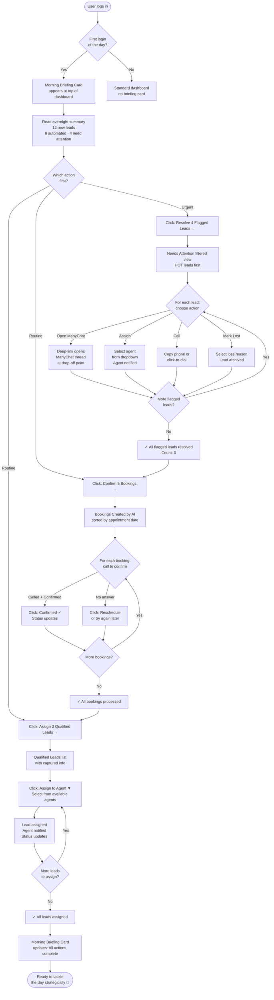
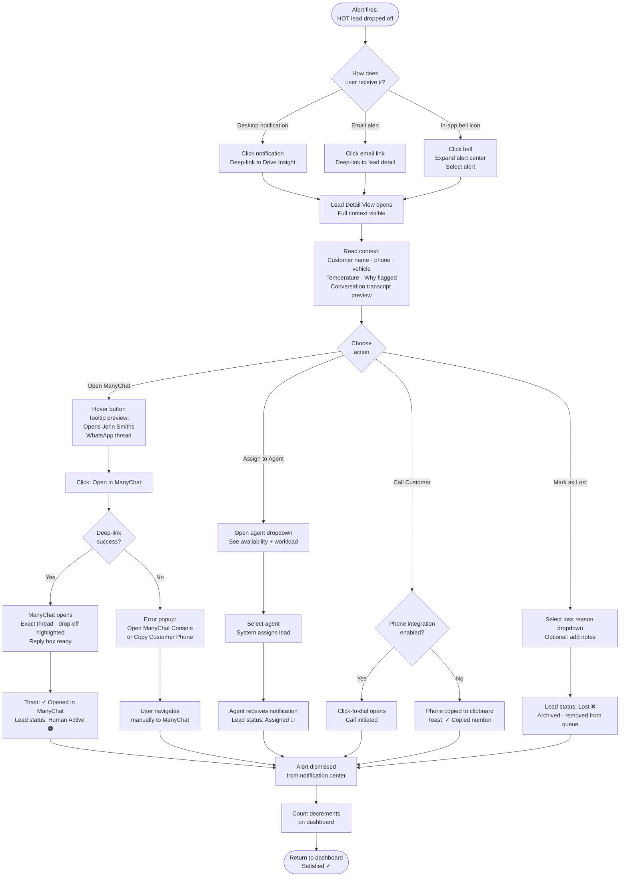
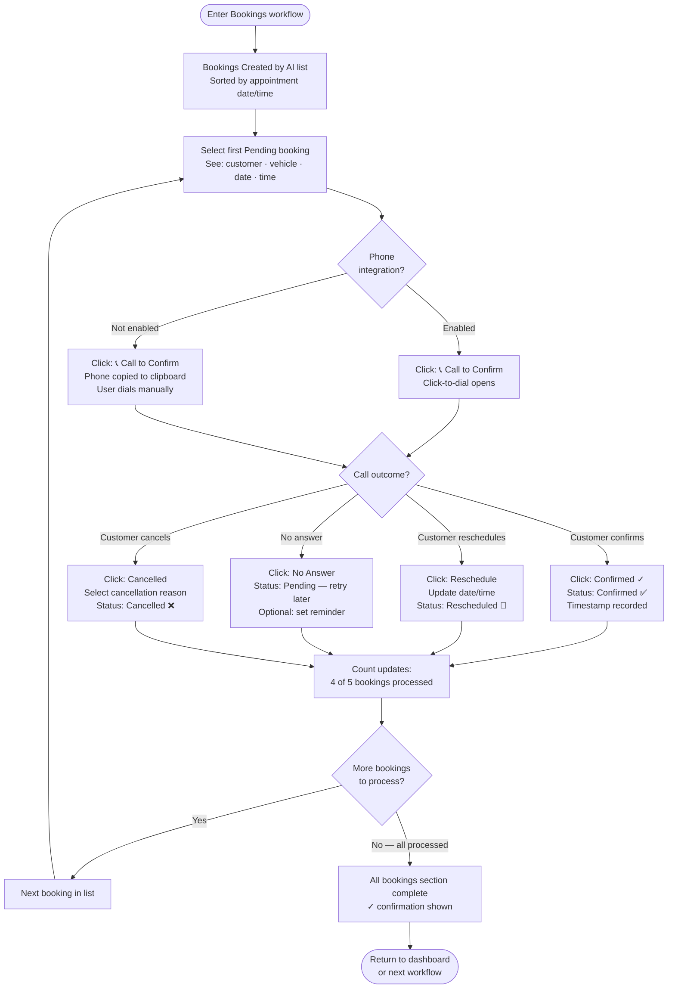
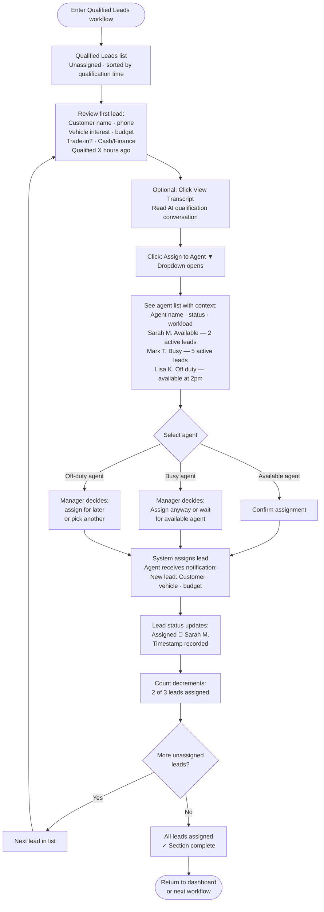
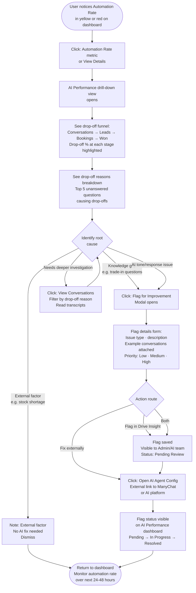

# User Journey Flows

## Journey 1: Morning Review Ritual

**Persona:** Sales Manager / Dealer Principal
**Entry Point:** First login of the day (any time — Morning Briefing persists until dismissed)
**Goal:** Resolve all overnight leads systematically before starting the sales day
**Success:** All three action queues addressed — pipeline under control

**Flow Optimisations:**
- Suggested priority order shown in briefing (Flagged → Bookings → Assign) but user can start anywhere
- Each workflow remembers position — user can switch between queues and return without losing progress
- Progress indicators visible throughout: "3 of 4 flagged leads resolved"
- Morning Briefing Card remains visible (sticky) until user explicitly dismisses or all queues are empty

---

## Journey 2: Alert-Driven Lead Rescue

**Persona:** Sales Manager / Agent
**Entry Point:** Desktop notification, email alert, or in-app bell icon
**Goal:** Rescue a dropped-off HOT/WARM lead before customer loses interest
**Success:** Lead contacted via ManyChat / assigned to agent / outcome recorded

**Flow Optimisations:**
- All three notification entry points converge on the same Lead Detail View — consistent experience regardless of how user arrived
- Deep-link failure handled gracefully with two fallback options (never a dead end)
- Lead status updates immediately on action — user sees confirmation without refreshing
- Alert auto-dismisses after action taken — no manual cleanup required

---

## Journey 3: Booking Confirmation Workflow

**Persona:** Sales Manager / Receptionist
**Entry Point:** Morning Briefing "Confirm 5 Bookings →" OR Bookings section in sidebar
**Goal:** Call each AI-created booking to confirm the appointment
**Success:** All bookings marked Confirmed or Rescheduled before appointment date

**Flow Optimisations:**
- Bookings sorted by appointment date by default — most urgent (soonest appointment) shown first
- Four clear call outcomes available inline — no modal required for standard actions
- "No Answer" keeps booking in pending state with optional reminder — nothing gets lost
- Bulk confirmation not available in MVP — each booking requires individual call confirmation (deliberate: ensures quality)

---

## Journey 4: Qualified Lead Assignment

**Persona:** Sales Manager
**Entry Point:** Morning Briefing "Assign 3 Qualified Leads →" OR Leads section filtered to "Qualified — Unassigned"
**Goal:** Assign each AI-qualified lead to the most appropriate available agent
**Success:** All qualified leads assigned — agents notified — pipeline moving

**Flow Optimisations:**
- Agent workload visible in assignment dropdown — manager makes informed decisions, not blind assignments
- "View Transcript" optional step — experienced managers may not need it, new managers find it valuable
- Off-duty agents can still be assigned leads (they'll see notification when they return)
- Assignment triggers immediate notification to agent — no separate communication step required

---

## Journey 5: AI Performance Investigation

**Persona:** Sales Manager / Dealer Principal
**Entry Point:** Automation Rate metric on dashboard (yellow or red threshold)
**Goal:** Understand why automation rate dropped and identify knowledge gaps to fix
**Success:** Root cause identified + flagged for improvement OR external fix initiated

**Flow Optimisations:**
- Single click from Automation Rate metric to drill-down — no navigation required
- Root cause analysis surfaces automatically (top 5 patterns) — manager doesn't have to manually detect patterns
- "View Conversations" available for deeper investigation without leaving Drive Insight
- Both internal flag AND external link available — accommodates teams who fix in ManyChat directly
- Flag status visible on performance dashboard — closure loop for manager ("was this fixed?")

---

## Journey Patterns

Across all 5 journeys, these reusable patterns emerge:

**1. Progressive Entry Pattern**
Every journey has multiple valid entry points (notification, briefing card, sidebar navigation) that all converge on the same destination. Users are never locked into one path.

**2. Inline Action Pattern**
All actions available at the point of decision — no navigation to separate screens for standard tasks. Actions: [Primary CTA] [Secondary] [Tertiary ▼ dropdown]

**3. Count Decrement Pattern**
Every action updates a visible count immediately. "4 → 3 → 2 → 1 → 0" creates satisfying progress closure and prevents double-handling.

**4. Context-Before-Action Pattern**
Every lead/booking shows full context (customer, vehicle, why flagged, transcript preview) before revealing actions. Users always know what they're acting on.

**5. Graceful Failure Pattern**
Every external dependency (ManyChat deep-link, phone integration) has a fallback path. No dead ends — always a way forward.

**6. Completion Signal Pattern**
Each journey ends with a clear completion state: "✓ All flagged leads resolved", "✓ All bookings confirmed", "✓ All leads assigned". Emotional closure reinforces the "accomplished" feeling.

---

## Flow Optimisation Principles

**1. Minimum viable steps to value**
No journey exceeds 4 user actions from entry to completion for the standard (happy) path. Complex paths (investigation, error recovery) add steps but are clearly signposted.

**2. Smart defaults reduce decisions**
- HOT leads always sorted first (no manual filter needed)
- Bookings sorted by appointment date (most urgent first)
- Agent dropdown shows availability status (informed choice, not guesswork)
- ManyChat opens to exact conversation (no search required)

**3. Error recovery is never a dead end**
Every failure state (deep-link error, no phone integration, no available agents) provides at least two recovery options. Users feel supported, not stuck.

**4. Actions match urgency**
- Urgent (flagged leads): Primary CTA = "Open ManyChat" (immediate human intervention)
- Routine (bookings): Primary CTA = "Call to Confirm" (systematic follow-up)
- Administrative (assignment): Primary CTA = "Assign to Agent ▼" (delegation)

**5. External tool handoffs are explicit**
Every jump to ManyChat or external AI platform is clearly signposted with:
- Button label that names the destination ("Open in ManyChat" not "Open")
- Tooltip confirming what will open
- Confirmation toast after successful handoff
- Fallback options if handoff fails

---
