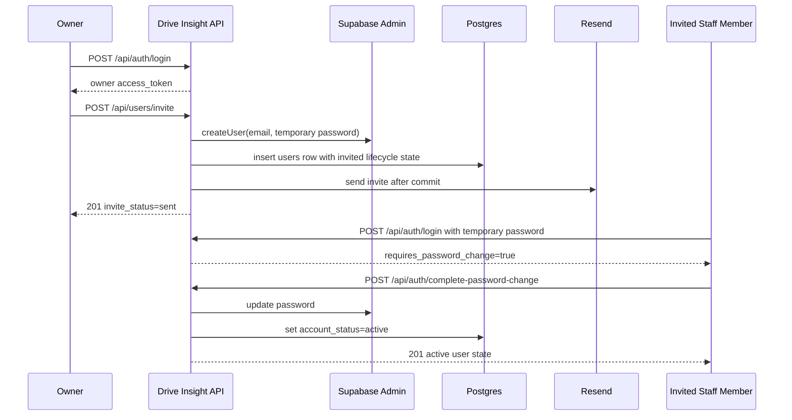

# API Module and Endpoint Testing Guide

This guide shows how to test the current `apps/api` surface at two levels:

- module by module, endpoint by endpoint
- business flow by business flow, where multiple endpoint calls are required to complete one function

It is written for manual API testing, QA regression checks, and test-case design alongside the existing Jest and Supertest coverage.

## Scope

The current public HTTP surface is:

- `GET /api/health`
- `GET /api/metrics`
- `POST /api/auth/login`
- `POST /api/auth/complete-password-change`
- `GET /api/users`
- `GET /api/users/whoami`
- `POST /api/users`
- `POST /api/users/invite`
- `PATCH /api/users/:id`
- `DELETE /api/users/:id`

There is no public logger endpoint. The logger module is tested through unit specs and application startup/runtime behavior.

## Prerequisites

- Root `.env` contains the current API, database, and Supabase settings:
  - `SUPABASE_URL`
  - `SUPABASE_ANON_KEY`
  - `SUPABASE_SERVICE_ROLE_KEY`
  - `SUPABASE_JWT_SECRET`
  - `DB_HOST`
  - `DB_PORT`
  - `DB_USER`
  - `DB_PASSWORD`
  - `DB_NAME`
  - `RESEND_API_KEY`
  - `RESEND_FROM_EMAIL`
- Local Supabase is running and migrations are applied.
- The API is running locally.

```bash
pnpm --filter @drive-insight/api start:dev
```

Helpful references:

- Swagger UI: `http://localhost:3001/api/docs`
- API base URL: `http://localhost:3001/api`

## Common Testing Rules

- All protected endpoints require `Authorization: Bearer <token>`.
- `tenant_id` is always derived from the authenticated JWT context. Do not send `tenant_id` in request bodies.
- Global validation is strict:
  - invalid DTO fields return `400`
  - unknown extra body fields return `400`
- Successful `POST` endpoints currently return `201`.
- `GET /api/health`, `GET /api/metrics`, and `POST /api/auth/login` are public.
- When `must_change_password = true`, the guard blocks all protected routes except `POST /api/auth/complete-password-change`.
- Row-level security still applies beneath the controllers. Cross-tenant rows are hidden rather than exposed.

## Quick Module Matrix

| Module | Endpoint(s) | Auth | Primary Purpose | Current Automated Coverage |
| --- | --- | --- | --- | --- |
| Health | `GET /api/health` | Public | Service smoke check | `apps/api/src/__tests__/auth/auth.integration.spec.ts` |
| Metrics | `GET /api/metrics` | Public | Prometheus scrape output | `apps/api/src/__tests__/auth/auth.integration.spec.ts`, `apps/api/src/modules/metrics/metrics.service.spec.ts` |
| Auth | `POST /api/auth/login`, `POST /api/auth/complete-password-change` | Public for login, Bearer for password change | Login, custom JWT issuance, first-login activation | `apps/api/src/__tests__/auth/auth.integration.spec.ts` |
| Users | `GET /api/users`, `GET /api/users/whoami`, `POST /api/users`, `POST /api/users/invite`, `PATCH /api/users/:id`, `DELETE /api/users/:id` | Bearer | Tenant-scoped user lifecycle and RBAC | `apps/api/src/__tests__/rbac/*.spec.ts`, `apps/api/src/__tests__/users/users-lifecycle.integration.spec.ts` |
| Logger | No HTTP endpoint | N/A | Application logging | `apps/api/src/modules/logger/logger.service.spec.ts` |
| Transactional Email | No HTTP endpoint | N/A | Invite email delivery via Resend | Covered indirectly by invite integration tests with mocked fetch |
| Supabase Admin | No HTTP endpoint | N/A | Auth user create, update, disable, delete | Covered indirectly by invite, activation, and deactivation flows |

## Canonical `working_hours` Payload

Use this exact shape when testing `PATCH /api/users/:id` for agent profile updates:

```json
{
  "monday": { "enabled": true, "start": "08:00", "end": "17:00" },
  "tuesday": { "enabled": true, "start": "08:00", "end": "17:00" },
  "wednesday": { "enabled": true, "start": "08:00", "end": "17:00" },
  "thursday": { "enabled": true, "start": "08:00", "end": "17:00" },
  "friday": { "enabled": true, "start": "08:00", "end": "16:00" },
  "saturday": { "enabled": false, "start": null, "end": null },
  "sunday": { "enabled": false, "start": null, "end": null }
}
```

Validation rules:

- Every day key is required.
- `start` and `end` must use `HH:MM` 24-hour format when enabled.
- If `enabled` is `true`, both `start` and `end` are required.
- If `enabled` is `true`, `start` must be earlier than `end`.

## Endpoint Reference

### Health Module

#### `GET /api/health`

- Authentication: none
- Path parameters: none
- Query parameters: none
- Body: none

Example request:

```bash
curl -X GET http://localhost:3001/api/health
```

Expected response:

```json
{
  "status": "ok",
  "timestamp": "2026-03-12T20:00:00.000Z"
}
```

Edge cases:

- If the API process is down, this fails at the transport layer rather than returning application JSON.
- This endpoint does not validate database connectivity. It is an API-process smoke check, not a full readiness check.

### Metrics Module

#### `GET /api/metrics`

- Authentication: none
- Path parameters: none
- Query parameters: none
- Body: none

Example request:

```bash
curl -X GET http://localhost:3001/api/metrics
```

Expected response:

- Status `200`
- Content type `text/plain`
- Prometheus-format metrics content

Edge cases:

- Do not expect JSON.
- This endpoint is intentionally public for scrape infrastructure.

### Auth Module

#### `POST /api/auth/login`

- Authentication: none
- Path parameters: none
- Query parameters: none
- Body:
  - `email` string, required, valid email
  - `password` string, required, minimum length 6

Example request:

```bash
curl -X POST http://localhost:3001/api/auth/login \
  -H 'Content-Type: application/json' \
  -d '{
    "email": "owner@example.com",
    "password": "password123"
  }'
```

Expected success response:

```json
{
  "access_token": "<jwt>",
  "user": {
    "id": "9c1306eb-39b9-4f74-9390-d6a6c95ee5ea",
    "email": "owner@example.com",
    "name": "Owner A",
    "role": "owner",
    "tenant_id": "11111111-1111-1111-1111-111111111111",
    "account_status": "active",
    "must_change_password": false,
    "invited_at": null,
    "activated_at": "2026-03-12T20:00:00.000Z",
    "disabled_at": null
  },
  "requires_password_change": false
}
```

Edge cases:

- Invalid credentials return `401`.
- Valid Supabase credentials but no matching local `users` row return `401`.
- Disabled users return `401` with `Account disabled`.
- Invited users can log in with the temporary password, but the response sets:
  - `requires_password_change: true`
  - `user.account_status: "invited"`
  - `user.must_change_password: true`
- Invalid email format returns `400`.
- Missing required fields return `400`.

#### `POST /api/auth/complete-password-change`

- Authentication: Bearer token required
- Path parameters: none
- Query parameters: none
- Body:
  - `newPassword` string, required, minimum length 12, maximum length 128

Example request:

```bash
curl -X POST http://localhost:3001/api/auth/complete-password-change \
  -H 'Authorization: Bearer <invited-user-token>' \
  -H 'Content-Type: application/json' \
  -d '{
    "newPassword": "UpdatedPassword123!"
  }'
```

Expected success response:

```json
{
  "message": "Password updated successfully",
  "user": {
    "id": "9c1306eb-39b9-4f74-9390-d6a6c95ee5ea",
    "email": "invited@example.com",
    "name": "Invited Agent",
    "role": "agent",
    "tenant_id": "11111111-1111-1111-1111-111111111111",
    "account_status": "active",
    "must_change_password": false,
    "invited_at": "2026-03-12T20:00:00.000Z",
    "activated_at": "2026-03-12T20:05:00.000Z",
    "disabled_at": null
  }
}
```

Edge cases:

- Missing or invalid token returns `401`.
- Disabled users return `401`.
- If the user no longer requires a password change, the endpoint returns `400`.
- Passwords shorter than 12 characters return `400`.
- Until this call succeeds, other protected endpoints return `403` for invited users.

### Users Module

#### `GET /api/users`

- Authentication: Bearer token required
- Path parameters: none
- Query parameters: none
- Body: none

Example request:

```bash
curl -X GET http://localhost:3001/api/users \
  -H 'Authorization: Bearer <token>'
```

Expected success response:

- Owner or manager: full list of tenant users only
- Agent: only the authenticated agent row

Sample response item:

```json
{
  "id": "9c1306eb-39b9-4f74-9390-d6a6c95ee5ea",
  "email": "agent@example.com",
  "name": "Agent A",
  "role": "agent",
  "tenant_id": "11111111-1111-1111-1111-111111111111",
  "account_status": "active",
  "must_change_password": false,
  "invited_at": null,
  "activated_at": "2026-03-12T20:00:00.000Z",
  "disabled_at": null,
  "created_at": "2026-03-12T19:55:00.000Z"
}
```

Edge cases:

- Missing, invalid, expired, or malformed tokens return `401`.
- Tokens missing a role claim return `401`.
- Invited users with `must_change_password = true` receive `403` until they finish the password-change flow.
- Cross-tenant users are never returned.

#### `GET /api/users/whoami`

- Authentication: Bearer token required
- Path parameters: none
- Query parameters: none
- Body: none

Example request:

```bash
curl -X GET http://localhost:3001/api/users/whoami \
  -H 'Authorization: Bearer <token>'
```

Expected success response:

```json
{
  "user": {
    "id": "9c1306eb-39b9-4f74-9390-d6a6c95ee5ea",
    "tenant_id": "11111111-1111-1111-1111-111111111111",
    "role": "manager",
    "email": "manager@example.com",
    "account_status": "active",
    "must_change_password": false
  },
  "message": "Authenticated successfully"
}
```

Edge cases:

- Use this endpoint to confirm the token maps to the expected tenant and role before testing any role-sensitive flow.
- Authentication failures match the same `401` rules as `GET /api/users`.

#### `POST /api/users`

- Authentication: Bearer token required
- Allowed caller roles: `owner`, `manager`
- Path parameters: none
- Query parameters: none
- Body:
  - `email` string, required, valid email
  - `name` string, required, max length 255
  - `role` string, required, one of `owner`, `manager`, `agent`

Example request:

```bash
curl -X POST http://localhost:3001/api/users \
  -H 'Authorization: Bearer <owner-or-manager-token>' \
  -H 'Content-Type: application/json' \
  -d '{
    "email": "new.user@example.com",
    "name": "New User",
    "role": "agent"
  }'
```

Expected success response:

```json
{
  "id": "9c1306eb-39b9-4f74-9390-d6a6c95ee5ea",
  "tenant_id": "11111111-1111-1111-1111-111111111111",
  "email": "new.user@example.com",
  "role": "agent",
  "name": "New User",
  "account_status": "active",
  "must_change_password": false
}
```

Edge cases:

- Agents receive `403`.
- `tenant_id` is not accepted in the body. Sending it returns `400` because extra DTO fields are forbidden.
- This is a local database create only. It does not create a Supabase Auth user and does not send an invitation email.
- Use this endpoint for local-only setup or controlled data creation, not for onboarding a login-capable staff member.

#### `POST /api/users/invite`

- Authentication: Bearer token required
- Allowed caller roles: `owner`
- Path parameters: none
- Query parameters: none
- Body:
  - `email` string, required, valid email
  - `name` string, required, max length 255
  - `role` string, required, one of `owner`, `manager`, `agent`

Example request:

```bash
curl -X POST http://localhost:3001/api/users/invite \
  -H 'Authorization: Bearer <owner-token>' \
  -H 'Content-Type: application/json' \
  -d '{
    "email": "invited.agent@example.com",
    "name": "Invited Agent",
    "role": "agent"
  }'
```

Expected success response for first invite:

```json
{
  "message": "Invitation sent to invited.agent@example.com",
  "invite_status": "sent",
  "invite_email_status": "sent",
  "user": {
    "id": "9c1306eb-39b9-4f74-9390-d6a6c95ee5ea",
    "tenant_id": "11111111-1111-1111-1111-111111111111",
    "email": "invited.agent@example.com",
    "role": "agent",
    "name": "Invited Agent",
    "account_status": "invited",
    "must_change_password": true
  }
}
```

Expected success response for reinvite:

```json
{
  "message": "Invitation re-sent to invited.agent@example.com",
  "invite_status": "resent",
  "invite_email_status": "sent",
  "user": {
    "id": "9c1306eb-39b9-4f74-9390-d6a6c95ee5ea",
    "email": "invited.agent@example.com",
    "account_status": "invited",
    "must_change_password": true
  }
}
```

Edge cases:

- Managers and agents receive `403`.
- If the same email already exists in the same tenant with `account_status = active`, the endpoint returns `409`.
- If the same email already exists in the same tenant with `account_status = disabled`, the endpoint returns `409`.
- If the email is already invited in the same tenant and the local row is still aligned with Supabase Auth, the endpoint returns `201` with `invite_status: "resent"`.
- If the email exists as a Supabase Auth account outside this local flow, the endpoint returns `409`.
- `tenant_id` in the body is rejected with `400`.
- Important recovery case: invite email sending runs after the database commit. If Resend fails or is misconfigured, the API can return an error after the auth user and local row already exist. Retrying the same request is the intended recovery path and should hit the deterministic reinvite path instead of creating duplicates.

#### `PATCH /api/users/:id`

- Authentication: Bearer token required
- Allowed caller roles: `owner`
- Path parameters:
  - `id` string, required, target user ID
- Query parameters: none
- Body: all fields optional
  - `email` string, valid email
  - `name` string, max length 255
  - `role` string, one of `owner`, `manager`, `agent`
  - `working_hours` object, must match the canonical schema
  - `availability` boolean

Example request:

```bash
curl -X PATCH http://localhost:3001/api/users/9c1306eb-39b9-4f74-9390-d6a6c95ee5ea \
  -H 'Authorization: Bearer <owner-token>' \
  -H 'Content-Type: application/json' \
  -d '{
    "name": "Updated Agent",
    "availability": false,
    "working_hours": {
      "monday": { "enabled": true, "start": "08:00", "end": "17:00" },
      "tuesday": { "enabled": true, "start": "08:00", "end": "17:00" },
      "wednesday": { "enabled": true, "start": "08:00", "end": "17:00" },
      "thursday": { "enabled": true, "start": "08:00", "end": "17:00" },
      "friday": { "enabled": true, "start": "08:00", "end": "16:00" },
      "saturday": { "enabled": false, "start": null, "end": null },
      "sunday": { "enabled": false, "start": null, "end": null }
    }
  }'
```

Expected success response:

```json
{
  "id": "9c1306eb-39b9-4f74-9390-d6a6c95ee5ea",
  "name": "Updated Agent",
  "agent_profile": {
    "user_id": "9c1306eb-39b9-4f74-9390-d6a6c95ee5ea",
    "availability": false,
    "working_hours": {
      "monday": { "enabled": true, "start": "08:00", "end": "17:00" }
    }
  }
}
```

Edge cases:

- Managers and agents receive `403`.
- Cross-tenant target users return `404`.
- Unknown target IDs return `404`.
- Invalid `working_hours` payloads return `400`.
- Sending `working_hours` or `availability` when the target user is not effectively an `agent` returns `400`.
- If the user has no `agent_profiles` row yet, the endpoint creates one inside the same request transaction.

#### `DELETE /api/users/:id`

- Authentication: Bearer token required
- Allowed caller roles: `owner`
- Path parameters:
  - `id` string, required, target user ID
- Query parameters: none
- Body: none

Example request:

```bash
curl -X DELETE http://localhost:3001/api/users/9c1306eb-39b9-4f74-9390-d6a6c95ee5ea \
  -H 'Authorization: Bearer <owner-token>'
```

Expected success response:

```json
{
  "message": "User 9c1306eb-39b9-4f74-9390-d6a6c95ee5ea disabled successfully",
  "user": {
    "id": "9c1306eb-39b9-4f74-9390-d6a6c95ee5ea",
    "account_status": "disabled",
    "must_change_password": false
  },
  "lead_unassignment": {
    "status": "blocked",
    "reason": "Lead assignment entities do not exist in the current codebase, so lead unassignment remains an explicit follow-up dependency"
  }
}
```

Edge cases:

- Managers and agents receive `403`.
- Owners cannot deactivate themselves. This returns `400`.
- Disabling the last active owner in a tenant returns `409`.
- Cross-tenant target users return `404`.
- If the target user is already disabled, the endpoint still returns `200` with an "already disabled" message.
- After deactivation, login for the disabled user is rejected. In test runs this is accepted as `401` or `403` depending on the auth path timing.

## Multi-Endpoint Integration Flows

### Flow 1: Smoke Check and Auth Bootstrap

Use this when you want to confirm the API is reachable before testing business logic.

1. `GET /api/health`
2. `GET /api/metrics`
3. `POST /api/auth/login`
4. `GET /api/users/whoami`

Expected outcome:

- The service is up.
- Public routes are reachable without a token.
- Login returns a JWT.
- `whoami` confirms the current tenant and role before deeper testing.

### Flow 2: Owner Invites a Staff Member and the Staff Member Activates the Account



Call sequence:

1. `POST /api/auth/login` as an owner
2. `POST /api/users/invite`
3. `POST /api/auth/login` as the invited user with the temporary password
4. `GET /api/users`
   - expect `403` because password change is still required
5. `POST /api/auth/complete-password-change`
6. `POST /api/auth/login` with the new password
7. `GET /api/users/whoami` or `GET /api/users`

Checks:

- Invite response returns `invite_status: "sent"` or `invite_status: "resent"`.
- First invited login returns `requires_password_change: true`.
- Protected routes are blocked until password change completes.
- After password change, re-login returns `requires_password_change: false`.

Main edge cases to cover:

- Reinviting the same invited email returns `201` with `invite_status: "resent"`.
- Inviting an already active user returns `409`.
- Inviting as manager or agent returns `403`.
- Invite email delivery failures can require a reinvite retry because the auth/local records may already exist.

### Flow 3: Manager Creates a Local-Only User Record

Use this only when you need a tenant-scoped `users` row without a login-capable Supabase account.

Call sequence:

1. `POST /api/auth/login` as a manager or owner
2. `POST /api/users`
3. `GET /api/users`

Checks:

- Response tenant matches the caller tenant.
- `account_status` is `active`.
- `must_change_password` is `false`.

Main edge cases to cover:

- Agent caller returns `403`.
- Sending `tenant_id` or other extra properties returns `400`.
- This flow does not create credentials, so the created record cannot log in by itself.

### Flow 4: Owner Updates Agent Availability and Working Hours

Call sequence:

1. `POST /api/auth/login` as owner
2. `PATCH /api/users/:id`
3. `GET /api/users`

Checks:

- The target user row updates.
- `agent_profile` is returned in the patch response.
- `availability` and `working_hours` persist correctly.

Main edge cases to cover:

- Manager or agent caller returns `403`.
- Cross-tenant target returns `404`.
- Invalid `working_hours` shape returns `400`.
- Applying agent profile fields to a non-agent role returns `400`.

### Flow 5: Owner Deactivates a Staff Member

Call sequence:

1. `POST /api/auth/login` as owner
2. `DELETE /api/users/:id`
3. `POST /api/auth/login` as the disabled user
4. `GET /api/users`

Checks:

- Response shows `account_status: "disabled"`.
- `disabled_at` is populated in the database.
- Disabled user login is rejected.
- The row is preserved rather than deleted.

Main edge cases to cover:

- Owner self-deactivation returns `400`.
- Last owner deactivation returns `409`.
- Manager or agent caller returns `403`.
- Cross-tenant target returns `404`.
- Lead unassignment is not implemented yet and should remain `blocked` in the response.

### Flow 6: Tenant Isolation and Role Boundaries

Use this flow when validating that RBAC and RLS work together.

Recommended checks:

1. Login as owner in Tenant A and list users.
2. Login as manager in Tenant A and list users.
3. Login as agent in Tenant A and list users.
4. Attempt invite, update, and delete as agent.
5. Attempt invite, update, and delete as manager.
6. Attempt update or delete from Tenant A against a user in Tenant B.

Expected outcomes:

- Owner sees all users in the current tenant only.
- Manager sees all users in the current tenant only.
- Agent sees only the authenticated agent row.
- Agent invite, update, and delete attempts return `403`.
- Manager invite, update, and delete attempts return `403`.
- Cross-tenant update and delete attempts return `404`.

## Recommended Automated Test Commands

Use these commands to validate the same flows in automation:

```bash
pnpm --filter @drive-insight/api test -- --runInBand src/__tests__/auth/auth.integration.spec.ts
```

```bash
pnpm --filter @drive-insight/api test -- --runInBand src/__tests__/rbac/owner-manager-access.spec.ts src/__tests__/rbac/agent-access.spec.ts src/__tests__/users/users-lifecycle.integration.spec.ts
```

```bash
pnpm --filter @drive-insight/api test -- --runInBand src/modules/logger/logger.service.spec.ts src/modules/metrics/metrics.service.spec.ts
```

```bash
pnpm --filter @drive-insight/database test -- --runInBand role-based-rls.test.ts
```

## Known Testing Notes

- The API test harness loads environment variables from the root `.env` via `dotenv-cli`.
- Invite email tests mock outbound Resend calls and still verify the provider boundary is reached.
- The local database must have the latest lifecycle migration applied before running user lifecycle tests.
- A broader `packages/database` test run still has a known failing `tenant-rls-audit` suite at the time of writing. Use the targeted role-based RLS suite above when validating the user lifecycle changes.
